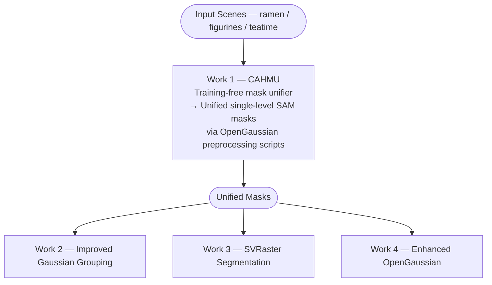

# Open-Vocabulary 3D Scene Understanding

<div align="center">

**Comparative Analysis of Open-Vocabulary 3D Scene Understanding using Enhanced SAM Masks and Multiple Segmentation Methods**

*M.Tech in Artificial Intelligence · Indian Institute of Science (IISc), Bengaluru*

---

[](https://www.python.org/)
[](https://developer.nvidia.com/cuda-toolkit)
[](https://pytorch.org/)
[](LICENSE)
[](https://drive.google.com/file/d/1zYouNBcMpjcJbbW5qMT-cCRQO6wWLh_P/view?usp=drive_link)
[](https://drive.google.com/file/d/1hHl7NpNGf80wvo7Ca7xD411aMDfha0Tj/view?usp=drive_link)

</div>

---

## Table of Contents

- [Overview](#overview)
- [Repository Structure](#repository-structure)
- [Works Summary](#works-summary)
- [Datasets and Evaluation](#datasets-and-evaluation)
- [Prerequisites](#prerequisites)
- [Work 1 — CAHMU: Context-Aware Hierarchical Mask Unifier](#work-1--cahmu-context-aware-hierarchical-mask-unifier)
- [Work 2 — Improved Gaussian Grouping](#work-2--improved-gaussian-grouping)
- [Work 3 — Segmentation over Sparse Voxel Rasterization (SVRaster)](#work-3--segmentation-over-sparse-voxel-rasterization-svraster)
- [Work 4 — Enhanced OpenGaussian](#work-4--enhanced-opengaussian)
- [Evaluation Metrics](#evaluation-metrics)
- [Results](#results)
- [References](#references)
- [Citation](#citation)

---

## Overview

This repository contains the full experimental codebase for the M.Tech thesis on **Open-Vocabulary 3D Scene Understanding**, systematically investigating how enhanced segmentation mask supervision and novel 3D learning objectives can advance the state-of-the-art in open-vocabulary, text-query-driven 3D instance segmentation over radiance-field representations.

Four interconnected contributions are introduced:

| # | Contribution | Description |
|:---:|---|---|
| **1** | **CAHMU** | Training-free, [CLIP](https://arxiv.org/abs/2103.00020)-driven hierarchical mask unifier resolving multi-level [SAM](https://arxiv.org/abs/2304.02643) granularity conflicts |
| **2** | **Improved Gaussian Grouping** | Augments [3DGS](https://arxiv.org/abs/2308.04079) identity encoding with contrastive, hypersphere, and GST losses, built on [Gaussian Grouping](https://arxiv.org/abs/2312.00732) |
| **3** | **Segmentation over SVRaster** | First end-to-end object-feature learning over [SVRaster](https://arxiv.org/abs/2409.12512), with contrastive, hypersphere, and Voxel Semantic Tracing (VST) losses |
| **4** | **Enhanced OpenGaussian** | Systematic mask-type and scene-cropping ablation of [OpenGaussian](https://arxiv.org/abs/2406.02058) with CAHMU-refined [CLIP](https://arxiv.org/abs/2103.00020) supervision |

---

## Repository Structure

```
Open-Vocabulary-3D-Scene-Understanding/
│
├── modified-gaussian-grouping/          # Work 2: Modified Gaussian Grouping
│   ├── submodules/
│   │   ├── diff-gaussian-rasterization/
│   │   ├── simple-knn/
│   │   ├── fused-ssim/
│   │   ├── GroundingDINO/
│   │   ├── deva/
│   │   ├── sam-hq/
│   │   └── depth-anything-v2/
│   ├── script/
│   │   ├── download_models.sh
│   │   ├── prepare_pseudo_label.sh
│   │   └── train_render_eval.sh
│   ├── config/
│   │   └── GroundingDINO_SwinB_cfg.py   ← Download manually (see Work 2 setup)
│   ├── checkpoints/                     ← Populated by download_models.sh
│   │   ├── depth_anything_v2_vitg.pth
│   │   ├── depth_anything_v2_vitl.pth
│   │   ├── DEVA-propagation.pth
│   │   ├── groundingdino_swinb_cogcoor.pth
│   │   ├── sam_hq_vit_h.pth
│   │   └── sam_vit_h_4b8939.pth
│   ├── data/
│   │   ├── ramen/
│   │   ├── figurines/
│   │   ├── teatime/
│   │   └── label/
│   │       ├── ramen/
│   │       ├── figurines/
│   │       └── teatime/
│   ├── json_to_masks.py
│   ├── environment.yml
│   └── runner_of_gaussian-grouping.sh
│
├── modified-svraster/                   # Work 3: SVRaster-based segmentation
│   ├── cuda/
│   ├── fused-ssim/
│   ├── GroundingDINO/
│   ├── sam-hq/
│   ├── scripts/
│   │   └── train_render_eval.sh
│   ├── cfg/
│   │   └── GroundingDINO_SwinB_cfg.py   ← Copy from Work 2 config/
│   ├── checkpoints/                     ← Copy from Work 2 checkpoints/
│   │   ├── groundingdino_swinb_cogcoor.pth
│   │   ├── sam_hq_vit_h.pth
│   │   └── sam_vit_h_4b8939.pth
│   ├── data/                            ← Copy entire data/ from Work 2
│   │   ├── ramen/
│   │   ├── figurines/
│   │   └── teatime/
│   ├── environment.yml
│   └── runner_of_svraster.sh
│
├── modified-OpenGaussian/               # Works 1 & 4: CAHMU + Enhanced OpenGaussian
│   ├── submodules/
│   │   ├── ashawkey-diff-gaussian-rasterization/
│   │   ├── sam-langsplat/
│   │   └── sam-hq/
│   ├── assets/
│   │   └── text_features.zip
│   ├── scripts/
│   │   └── train_render_eval.sh
│   ├── ckpts/                           ← Copy from Work 2/3 checkpoints/
│   │   ├── sam_hq_vit_h.pth
│   │   └── sam_vit_h_4b8939.pth
│   ├── data/
│   │   └── lerf_ovs/
│   │       ├── ramen/
│   │       ├── figurines/
│   │       └── teatime/
│   ├── preprocess_sam_l.py
│   ├── preprocess_sam_hq.py
│   ├── preprocess_sam_u.py
│   ├── masks_visualizer.py
│   ├── train_normal.py
│   ├── crop_scene.py
│   ├── crop_images.py
│   ├── render_lerf_by_text.py
│   ├── environment.yml
│   └── runner_of_OpenGaussian.sh
│
├── methodologies/                       ← Methodology figures
├── experiments/                         ← Experiment result figures
└── README.md
```

> **⚠️ Data Layout — Important**
> - **Works 2 & 3:** scene data at `data/<scene>/`; JSON labels at `data/label/<scene>/`
> - **Work 4:** scene data at `data/lerf_ovs/<scene>/`; JSON labels at `data/lerf_ovs/label/<scene>/`
>
> Do **not** deviate from these directory structures — all scripts reference these paths directly.

---

## Works Summary

<div align="center">



</div>

---

## Datasets and Evaluation

All experiments use the **LeRF-OVS** dataset from [LERF](https://arxiv.org/abs/2303.09553), comprising three real-world tabletop scenes captured with Polycam: `figurines`, `teatime`, and `ramen`.

### Downloads

| Resource | Link |
|---|---|
| Expanded LeRF-OVS + COLMAP data | 📦 [Download](https://drive.google.com/file/d/1QF1Po5p5DwTjFHu6tnTeYs_G0egMVmHt/view?usp=sharing) |
| Preprocessed dataset — Works 2 & 3 | 🗂️ [Download](https://drive.google.com/file/d/1pnp4LDTLRCmQgm3-XNj7dpqm4nTURihA/view?usp=sharing) |
| Preprocessed dataset — Work 4 | 🗂️ [Download](https://drive.google.com/file/d/18ymU_tpFczdMf0N4k-59BG5H5erGAIbF/view?usp=sharing) |

After downloading, place scenes in the correct directories:

```
# Works 2 & 3
modified-gaussian-grouping/data/{ramen,figurines,teatime}/
modified-svraster/data/{ramen,figurines,teatime}/

# Work 4
modified-OpenGaussian/data/lerf_ovs/{ramen,figurines,teatime}/
```

### Scene Overview

| Scene | Training Frames | Object Density | Notable Objects |
|---|---|---|---|
| `ramen` | 1–131 | Medium | nori, sake cup, kamaboko, corn, spoon, egg, chopsticks, wavy noodles, bowl, napkin, etc. |
| `figurines` | **1–250** ⚠️ | High | jake, pikachu, rubber duck, pirate hat, waldo, tesla door handle, porcelain hand, etc. |
| `teatime` | 1–180 | Low–Medium | sheep, stuffed bear, coffee mug, cookies, apple, yellow pouf, dall-e brand, etc. |

> **⚠️ Figurines — use frames 1–250 only (all Works).**
> [DEVA](https://arxiv.org/abs/2309.03903) encodes multi-view object identities as `short` integers, hard-capping simultaneously trackable identities at **256**. Processing all 301 frames of `figurines` exhausts this capacity mid-sequence, corrupting identity maps in later frames. `ramen` (1–131) and `teatime` (1–180) fall within the safe limit and are used in full.

### Evaluation Protocol

Evaluation frames and text queries are **fixed across all experiments** for strict comparability.

| Scene | Queries | Evaluation Frames |
|---|---|---|
| `ramen` | nori, sake cup, kamaboko, corn, spoon, egg, onion segments, plate, napkin, bowl, glass of water, chopsticks, wavy noodles | 00006, 00024, 00060, 00065, 00081, 00119, 00128 |
| `figurines` | jake, pirate hat, pikachu, rubber duck with hat, porcelain hand, red apple, tesla door handle, waldo, bag, toy cat statue, miffy, green apple, pumpkin, rubics cube, old camera, rubber duck with buoy, red toy chair, pink ice cream, spatula, green toy chair, toy elephant | 00041, 00105, 00152, 00195 |
| `teatime` | sheep, yellow pouf, stuffed bear, coffee mug, tea in a glass, apple, coffee, hooves, bear nose, dall-e brand, plate, paper napkin, three cookies, bag of cookies | 00002, 00025, 00043, 00107, 00129, 00140 |

### Hardware Requirements

| Work | Scene | GPU |
|---|---|---|
| Work 2 | figurines, ramen | NVIDIA A6000 48 GB |
| Work 2 | teatime | NVIDIA A100 80 GB |
| Work 3 | all scenes | NVIDIA A100 80 GB |
| Work 4 | all scenes | NVIDIA A6000 48 GB |

---

## Prerequisites

All codebases share the following requirements:

- **CUDA 12.1** (`nvidia/label/cuda-12.1.0`)
- **Conda** (Miniconda or Anaconda)
- **GCC / G++** at `/usr/bin/gcc` and `/usr/bin/g++`
- **GPU architecture flags:** `8.0` (A100) and/or `8.6` (A6000 / RTX 3090)

> **⚠️ Each work uses its own isolated conda environment. Do not share environments across works.**

---

## Work 1 — CAHMU: Context-Aware Hierarchical Mask Unifier

**CAHMU** is a **training-free** preprocessing module that resolves granularity conflicts in multi-level [SAM](https://arxiv.org/abs/2304.02643) outputs using [CLIP](https://arxiv.org/abs/2103.00020)-driven objectness scoring, producing a clean, instance-discriminative single-level mask set. These unified masks serve as supervision for Works 2 and 4.

> CAHMU mask generation is embedded in the **OpenGaussian runner** (`runner_of_OpenGaussian.sh`) via `preprocess_sam_u.py`.

### Algorithm

CAHMU operates in two sequential phases:

- **Phase 1 — Top-down subdivision:** Per-mask objectness *o(m)*, complexity *κ(m)*, and HS-histogram appearance *h(m)* are extracted. Large-level SAM masks are selectively replaced by their medium-level children when child appearance diversity satisfies a dynamic threshold.
- **Phase 2 — Orphan recovery & overlap resolution:** Medium- and small-level orphan masks occupying uncovered foreground regions (vacuum overlap ratio *r(m) < 0.5*) are recovered. Residual spatial overlaps are resolved by painting in ascending objectness order — higher-objectness masks take unconditional spatial priority.

<p align="center">
  
</p>
<p align="center"><em>Figure 1 — CAHMU algorithm: Phase 1 top-down subdivision gated by objectness, complexity, and child appearance diversity; Phase 2 vacuum-filling and objectness-priority overlap resolution.</em></p>

### Key Thresholds

| Parameter | Value |
|---|---|
| CLIP temperature τ | 25.0 |
| Containment ratio | > 0.8 |
| Complexity–objectness band (κ, o) | (0.45, 0.85) |
| Pairwise histogram-correlation gate | (0.25, 0.75) |
| Dynamic split threshold θ_split | [0.4, 0.85] |
| Foreground-canvas inclusion | o > 0.1 |
| Vacuum-overlap ratio | r < 0.5 |
| Min residual mask area | 50 px |

### Setup & Usage

```bash
cd modified-OpenGaussian

# 1. Create and activate the environment
conda env create -f environment.yml
conda activate open_gaussian

# 2. Install CUDA toolkit and build tools
conda install -c "nvidia/label/cuda-12.1.0" cuda-toolkit -y
pip install ninja
export CC=/usr/bin/gcc CXX=/usr/bin/g++
export TORCH_CUDA_ARCH_LIST="8.0;8.6"

# 3. Install submodules
pip install --no-build-isolation submodules/ashawkey-diff-gaussian-rasterization
pip install --no-build-isolation "git+https://github.com/facebookresearch/pytorch3d.git"
pip install --no-build-isolation submodules/sam-langsplat
pip install --no-build-isolation submodules/sam-hq

# 4. Unzip text features
cd assets && unzip text_features.zip && cd ..

# 5. Copy SAM checkpoints (see Work 4 Checkpoint Setup)
#    ckpts/sam_hq_vit_h.pth
#    ckpts/sam_vit_h_4b8939.pth

# 6. Generate CAHMU-Unified SAM masks for each scene
python preprocess_sam_u.py --dataset_path data/lerf_ovs/ramen
python preprocess_sam_u.py --dataset_path data/lerf_ovs/ramen --crop

python preprocess_sam_u.py --dataset_path data/lerf_ovs/figurines
python preprocess_sam_u.py --dataset_path data/lerf_ovs/figurines --crop

python preprocess_sam_u.py --dataset_path data/lerf_ovs/teatime
python preprocess_sam_u.py --dataset_path data/lerf_ovs/teatime --crop

# (Optional) Visualise generated masks
python masks_visualizer.py --dataset_path data/lerf_ovs/ramen --variant sam_u
python masks_visualizer.py --dataset_path data/lerf_ovs/ramen --crop --variant sam_u
```

> The `--crop` flag generates masks from black-background cropped renders, used in Work 4 crop-setting ablations.

---

## Work 2 — Improved Gaussian Grouping

Work 2 augments [Gaussian Grouping](https://arxiv.org/abs/2312.00732) [[code]](https://github.com/lkeab/gaussian-grouping) with three novel loss terms over a [3DGS](https://arxiv.org/abs/2308.04079) backbone:

| Loss | Description |
|---|---|
| **Cont** | 2D + 3D contrastive loss — enforces intra-mask compactness and inter-mask separation in feature space |
| **Hyp** | 2D + 3D hypersphere normalisation — prevents large feature-norm dominance during alpha-compositing |
| **GST** | KL distillation via Gaussian Semantic Tracing — replaces hard multi-view labels with soft probabilistic KL distillation |

**✅ Best configuration: Exp 8** — CAHMU-unified masks on original images + Hyp loss → **41.72% mean mIoU**

### Feature Optimisation Architecture (Works 2 & 3)

<p align="center">
  
</p>
<p align="center"><em>Figure 2 — Feature optimisation architecture shared by Works 2 and 3. Modification 1: Multi-view Semantic Tracing with Probabilistic KL Distillation (ℒ<sub>KL–ST</sub>). Modification 2: 2D & 3D Contrastive Learning. Modification 3: 2D & 3D Hypersphere Regularisation. In Work 3, the Gaussian Grouping backbone is replaced by SVRaster and GST is replaced by VST; all other components are unchanged. Green: adopted in final configuration. Blue: evaluated and found to retain a similar best configuration (Modification 1 for Work 3).</em></p>

### Installation

```bash
cd modified-gaussian-grouping

conda env create -f environment.yml
conda activate my_gaussian_grouping

conda install -c "nvidia/label/cuda-12.1.0" cuda-toolkit -y
pip install ninja
export CC=/usr/bin/gcc CXX=/usr/bin/g++
export TORCH_CUDA_ARCH_LIST="8.0;8.6"

pip install --no-build-isolation ./submodules/diff-gaussian-rasterization
pip install --no-build-isolation ./submodules/simple-knn
pip install --no-build-isolation ./submodules/fused-ssim
pip install --no-build-isolation ./submodules/GroundingDINO
pip install --no-build-isolation ./submodules/deva
pip install --no-build-isolation ./submodules/sam-hq
pip install --no-build-isolation ./submodules/depth-anything-v2

# Download model checkpoints into checkpoints/
bash script/download_models.sh
```

> **⚠️ GroundingDINO config — manual download required.** The `wget` approach does not retrieve the raw file correctly from GitHub.
> 1. Open: [GroundingDINO_SwinB_cfg.py on GitHub](https://github.com/IDEA-Research/GroundingDINO/blob/main/groundingdino/config/GroundingDINO_SwinB_cfg.py)
> 2. Click **Raw** → save as `GroundingDINO_SwinB_cfg.py`
> 3. Place at `modified-gaussian-grouping/config/GroundingDINO_SwinB_cfg.py`

### Step 1 — Convert JSON Annotations to Masks

```bash
python json_to_masks.py --data_dir data/label/ramen
python json_to_masks.py --data_dir data/label/figurines
python json_to_masks.py --data_dir data/label/teatime
```

### Step 2 — Prepare Pseudo-Labels

Six mask variants per scene: three mask types ([SAM](https://arxiv.org/abs/2304.02643), [SAM-HQ](https://arxiv.org/abs/2306.01567), CAHMU-Unified) × two image sources (original, cropped):

```bash
# ramen
bash script/prepare_pseudo_label.sh ramen 1    sam
bash script/prepare_pseudo_label.sh ramen 1    sam_hq
bash script/prepare_pseudo_label.sh ramen 1    sam_unified
bash script/prepare_pseudo_label.sh ramen crop sam
bash script/prepare_pseudo_label.sh ramen crop sam_hq
bash script/prepare_pseudo_label.sh ramen crop sam_unified

# figurines — same pattern
bash script/prepare_pseudo_label.sh figurines 1    sam
bash script/prepare_pseudo_label.sh figurines 1    sam_hq
bash script/prepare_pseudo_label.sh figurines 1    sam_unified
bash script/prepare_pseudo_label.sh figurines crop sam
bash script/prepare_pseudo_label.sh figurines crop sam_hq
bash script/prepare_pseudo_label.sh figurines crop sam_unified

# teatime — same pattern
bash script/prepare_pseudo_label.sh teatime 1    sam
bash script/prepare_pseudo_label.sh teatime 1    sam_hq
bash script/prepare_pseudo_label.sh teatime 1    sam_unified
bash script/prepare_pseudo_label.sh teatime crop sam
bash script/prepare_pseudo_label.sh teatime crop sam_hq
bash script/prepare_pseudo_label.sh teatime crop sam_unified
```

> The generated mask folders (e.g. `object_mask_sam/`, `crop_object_mask_sam_hq/`) are reused by Work 3.

### Step 3 — Train, Render, and Evaluate

**Mask-quality ablation** (Exps 1–6 per scene, baseline losses only):

```bash
# ramen — repeat analogously for figurines and teatime
bash script/train_render_eval.sh ramen output_sam              object_mask_sam               normal
bash script/train_render_eval.sh ramen output_crop_sam         crop_object_mask_sam          normal
bash script/train_render_eval.sh ramen output_sam_unified      object_mask_sam_unified       normal
bash script/train_render_eval.sh ramen output_crop_sam_unified crop_object_mask_sam_unified  normal
bash script/train_render_eval.sh ramen output_sam_hq           object_mask_sam_hq            normal
bash script/train_render_eval.sh ramen output_crop_sam_hq      crop_object_mask_sam_hq       normal
```

**Loss ablation — Unified-Original baseline** (Exps 7–10):

```bash
bash script/train_render_eval.sh ramen output_sam_unified_cos object_mask_sam_unified cos
bash script/train_render_eval.sh ramen output_sam_unified_hyp object_mask_sam_unified hyp
bash script/train_render_eval.sh ramen output_sam_unified_gst object_mask_sam_unified gst
bash script/train_render_eval.sh ramen output_sam_unified_all object_mask_sam_unified all
```

**Loss ablation — HQ-SAM Cropped baseline** (Exps 11–14):

```bash
bash script/train_render_eval.sh ramen output_crop_sam_hq_cos crop_object_mask_sam_hq cos
bash script/train_render_eval.sh ramen output_crop_sam_hq_hyp crop_object_mask_sam_hq hyp
bash script/train_render_eval.sh ramen output_crop_sam_hq_gst crop_object_mask_sam_hq gst
bash script/train_render_eval.sh ramen output_crop_sam_hq_all crop_object_mask_sam_hq all
```

> Repeat all loss-ablation commands for `figurines` and `teatime`. See `runner_of_gaussian-grouping.sh` for the complete listing.

### Training Hyperparameters

| Parameter | Value |
|---|---|
| Iterations | 30,000 |
| Optimizer | Adam (default 3DGS schedule) |
| Identity feature classes | 256 |
| λ_GST | 50 |
| λ²ᵈ_cont | 5×10⁻⁴ |
| λ³ᵈ_cont | 2×10⁻² |
| λ²ᵈ_hyp | 10⁻³ |
| λ³ᵈ_hyp | 10⁻³ |
| GST update interval | 100 iters |
| GST views per update | 20 |

---

## Work 3 — Segmentation over Sparse Voxel Rasterization (SVRaster)

Work 3 introduces the **first end-to-end object-feature learning pipeline over [SVRaster](https://arxiv.org/abs/2409.12512)** [[code]](https://github.com/theialab/svraster), requiring new per-voxel object features and semantic-tracing weights added directly to the CUDA rasteriser. The novel **Voxel Semantic Tracing (VST)** loss provides soft probabilistic KL distillation of multi-view semantic consistency. The feature optimisation architecture is shared with Work 2 ([Figure 2](#feature-optimisation-architecture-works-2--3)).

**✅ Best configuration: Exp 13** — HQ-SAM on cropped renders + VST loss → **45.53% mean mIoU**

### Installation

```bash
cd modified-svraster

conda env create -f environment.yml
conda activate svraster

conda install -c "nvidia/label/cuda-12.1.0" cuda-toolkit -y
pip install ninja
export CC=/usr/bin/gcc CXX=/usr/bin/g++
export TORCH_CUDA_ARCH_LIST="8.0;8.6"

pip install --no-build-isolation ./cuda/
pip install --no-build-isolation ./fused-ssim/
pip install --no-build-isolation ./GroundingDINO/
pip install --no-build-isolation ./sam-hq/
```

> **⚠️ GroundingDINO config** — copy directly from Work 2 (simplest approach):
> ```bash
> cp modified-gaussian-grouping/config/GroundingDINO_SwinB_cfg.py \
>    modified-svraster/cfg/GroundingDINO_SwinB_cfg.py
> ```
> Alternatively, download manually from [GitHub](https://github.com/IDEA-Research/GroundingDINO/blob/main/groundingdino/config/GroundingDINO_SwinB_cfg.py).

### Data and Checkpoint Setup

Work 3 preprocessing is **identical** to Work 2. Copy Work 2's `data/` and `checkpoints/` directly:

```bash
# Copy preprocessed data (with all mask folders)
cp -r modified-gaussian-grouping/data modified-svraster/data

# Copy model checkpoints
mkdir -p modified-svraster/checkpoints
cp modified-gaussian-grouping/checkpoints/groundingdino_swinb_cogcoor.pth modified-svraster/checkpoints/
cp modified-gaussian-grouping/checkpoints/sam_hq_vit_h.pth                modified-svraster/checkpoints/
cp modified-gaussian-grouping/checkpoints/sam_vit_h_4b8939.pth            modified-svraster/checkpoints/
```

Expected structure after setup:

```
modified-svraster/
├── checkpoints/
│   ├── groundingdino_swinb_cogcoor.pth
│   ├── sam_hq_vit_h.pth
│   └── sam_vit_h_4b8939.pth
├── cfg/
│   └── GroundingDINO_SwinB_cfg.py
└── data/
    ├── ramen/
    ├── figurines/
    └── teatime/
```

### Train, Render, and Evaluate

The script takes an additional per-scene **bound scale** argument:

| Scene | Bound Scale |
|---|---|
| `ramen` | 1.5 |
| `figurines` | 0.025 |
| `teatime` | 1.0 |

**Mask-quality ablation** (Exps 1–6):

```bash
# ramen (bound scale 1.5) — repeat with figurines (0.025) and teatime (1.0)
bash scripts/train_render_eval.sh ramen output_sam              object_mask_sam               normal 1.5
bash scripts/train_render_eval.sh ramen output_crop_sam         crop_object_mask_sam          normal 1.5
bash scripts/train_render_eval.sh ramen output_sam_unified      object_mask_sam_unified       normal 1.5
bash scripts/train_render_eval.sh ramen output_crop_sam_unified crop_object_mask_sam_unified  normal 1.5
bash scripts/train_render_eval.sh ramen output_sam_hq           object_mask_sam_hq            normal 1.5
bash scripts/train_render_eval.sh ramen output_crop_sam_hq      crop_object_mask_sam_hq       normal 1.5
```

**Loss ablation — Unified-Original baseline** (Exps 7–10):

> **⚠️ Exps 9 & 10** (VST / all losses) significantly increase memory usage. Set `subdivide_until = 12000` and `prune_until = 15000` in `src/config.py` for these experiments.

```bash
bash scripts/train_render_eval.sh ramen output_sam_unified_cos object_mask_sam_unified cos 1.5
bash scripts/train_render_eval.sh ramen output_sam_unified_hyp object_mask_sam_unified hyp 1.5
bash scripts/train_render_eval.sh ramen output_sam_unified_vst object_mask_sam_unified vst 1.5  # subdivide_until=12000
bash scripts/train_render_eval.sh ramen output_sam_unified_all object_mask_sam_unified all 1.5  # subdivide_until=12000
```

**Loss ablation — HQ-SAM Cropped baseline** (Exps 11–14):

> **⚠️ Exps 13 & 14** follow the same memory constraint: `subdivide_until = 12000`, `prune_until = 15000`.

```bash
bash scripts/train_render_eval.sh ramen output_crop_sam_hq_cos crop_object_mask_sam_hq cos 1.5
bash scripts/train_render_eval.sh ramen output_crop_sam_hq_hyp crop_object_mask_sam_hq hyp 1.5
bash scripts/train_render_eval.sh ramen output_crop_sam_hq_vst crop_object_mask_sam_hq vst 1.5  # subdivide_until=12000
bash scripts/train_render_eval.sh ramen output_crop_sam_hq_all crop_object_mask_sam_hq all 1.5  # subdivide_until=12000
```

> See `runner_of_svraster.sh` for the complete command listing across all three scenes.

### Training Hyperparameters

| Parameter | Standard Exps | VST / All (Exps 9, 10, 13, 14) |
|---|:---:|:---:|
| Iterations | 20,000 | 20,000 |
| Voxel pruning until | 18,000 iters | **15,000 iters** |
| Voxel subdivision until | 15,000 iters | **12,000 iters** |
| num_objects (bits per dim) | 16 | 16 |
| num_classes | 256 | 256 |
| sh_objs_lr | 0.010 | 0.010 |
| λ²ᵈ | 0.05 | 0.05 |
| λ³ᵈ | 0.2 | 0.2 |
| λ_VST | — | 50 |
| λ²ᵈ_cont | 2×10⁻⁵ | 2×10⁻⁵ |
| λ³ᵈ_cont | 10⁻³ | 10⁻³ |
| λ²ᵈ_hyp | 5×10⁻⁵ | 5×10⁻⁵ |
| λ³ᵈ_hyp | 5×10⁻⁵ | 5×10⁻⁵ |
| VST update interval | — | 50 iters |
| VST views per update | — | 20 |

---

## Work 4 — Enhanced OpenGaussian

Work 4 builds on [OpenGaussian](https://arxiv.org/abs/2406.02058) [[code]](https://github.com/muedavid/OpenGaussian) with a systematic evaluation of mask supervision quality and scene-cropping strategies. The two-phase training schedule (geometry + colour features → language/object features) is retained from the original. Three candidate modifications are evaluated:

| Modification | Outcome |
|---|---|
| **Modified Preprocessing** — CAHMU-unified masks (Exp 7) as CLIP feature source | ✅ Adopted |
| **Objectness-based Cluster Pruning** — periodic low-objectness cluster pruning during Stage 2.1 | ❌ Detrimental (−19.2% mIoU) |
| **Two-Stage Text-Query Re-ranking** — top-10 cosine shortlist re-ranked by objectness; top-5 retained | ❌ Detrimental (−29.4% mIoU) |

**✅ Best configuration: Exp 7** — CAHMU-unified SAM on original images, no cropping → **59.02% mean mIoU** *(new state-of-the-art on LeRF-OVS)*

### Pipeline Overview

<p align="center">
  
</p>
<p align="center"><em>Figure 3 — Enhanced OpenGaussian pipeline. Green: adopted in final configuration. Red: evaluated but found detrimental, reverted to baseline.</em></p>

### Installation

> The Work 4 conda environment (`open_gaussian`) is **identical** to Work 1. If Work 1 is already set up, skip installation and proceed directly to Checkpoint Setup.

```bash
cd modified-OpenGaussian

conda env create -f environment.yml
conda activate open_gaussian

conda install -c "nvidia/label/cuda-12.1.0" cuda-toolkit -y
pip install ninja
export CC=/usr/bin/gcc CXX=/usr/bin/g++
export TORCH_CUDA_ARCH_LIST="8.0;8.6"

pip install --no-build-isolation submodules/ashawkey-diff-gaussian-rasterization
pip install --no-build-isolation "git+https://github.com/facebookresearch/pytorch3d.git"
pip install --no-build-isolation submodules/sam-langsplat
pip install --no-build-isolation submodules/sam-hq

cd assets && unzip text_features.zip && cd ..
```

### Checkpoint Setup

```bash
mkdir -p modified-OpenGaussian/ckpts
cp modified-gaussian-grouping/checkpoints/sam_hq_vit_h.pth     modified-OpenGaussian/ckpts/
cp modified-gaussian-grouping/checkpoints/sam_vit_h_4b8939.pth modified-OpenGaussian/ckpts/
```

Expected structure after setup:

```
modified-OpenGaussian/ckpts/
├── sam_hq_vit_h.pth
└── sam_vit_h_4b8939.pth
```

### Step 1 — Generate All Mask Variants

```bash
# ramen — repeat analogously for figurines and teatime
python preprocess_sam_l.py  --dataset_path data/lerf_ovs/ramen
python preprocess_sam_l.py  --dataset_path data/lerf_ovs/ramen --crop
python preprocess_sam_hq.py --dataset_path data/lerf_ovs/ramen
python preprocess_sam_hq.py --dataset_path data/lerf_ovs/ramen --crop
python preprocess_sam_u.py  --dataset_path data/lerf_ovs/ramen          # CAHMU (Work 1)
python preprocess_sam_u.py  --dataset_path data/lerf_ovs/ramen --crop
```

### Step 2 — Train Full-Scene 3DGS Geometry

```bash
python train_normal.py -s data/lerf_ovs/ramen     -m output_full_scene/ramen     --iterations 30_000
python train_normal.py -s data/lerf_ovs/figurines -m output_full_scene/figurines --iterations 30_000
python train_normal.py -s data/lerf_ovs/teatime   -m output_full_scene/teatime   --iterations 30_000
```

### Step 3 — (Optional) Crop Scene for Crop@30k Experiments

> Required only for Exps 2, 3, 5, 6, 8, 9. Padding values: `ramen` → `1.5`, `figurines` → `0.025`, `teatime` → `1.0`.

```bash
# ramen (padding 1.5) — repeat with figurines (0.025) and teatime (1.0)
cp -r output_full_scene/ramen output/ramen
python crop_scene.py  -m output/ramen --iteration 30000 --padding 1.5
python crop_images.py -m output/ramen --iteration 30000
```

### Step 4 — Mask & Cropping Ablation (Exps 1–9)

All commands follow the pattern:
```bash
cp -r <geometry_source>/<scene> <output_dir>/<scene>
bash scripts/train_render_eval.sh <scene> <output_dir> <feature_dir> <mode> <checkpoint>
```

**ramen — nine configurations** (repeat analogously for `figurines` and `teatime`):

```bash
# Exp 1: Large SAM, original image
cp -r output_full_scene/ramen output_sam_l_full_scene/ramen
bash scripts/train_render_eval.sh ramen output_sam_l_full_scene language_features_sam_l normal chkpnt30000

# Exp 2: Large SAM, cropped render
cp -r output_full_scene/ramen output_crop_sam_l_full_scene/ramen
bash scripts/train_render_eval.sh ramen output_crop_sam_l_full_scene crop_language_features_sam_l normal chkpnt30000

# Exp 3: Large SAM, Crop@30k
cp -r output/ramen output_crop_sam_l/ramen
bash scripts/train_render_eval.sh ramen output_crop_sam_l crop_language_features_sam_l normal chkpnt30000

# Exp 4: HQ-SAM, original image
cp -r output_full_scene/ramen output_sam_hq_full_scene/ramen
bash scripts/train_render_eval.sh ramen output_sam_hq_full_scene language_features_sam_hq normal chkpnt30000

# Exp 5: HQ-SAM, cropped render
cp -r output_full_scene/ramen output_crop_sam_hq_full_scene/ramen
bash scripts/train_render_eval.sh ramen output_crop_sam_hq_full_scene crop_language_features_sam_hq normal chkpnt30000

# Exp 6: HQ-SAM, Crop@30k
cp -r output/ramen output_crop_sam_hq/ramen
bash scripts/train_render_eval.sh ramen output_crop_sam_hq crop_language_features_sam_hq normal chkpnt30000

# Exp 7: CAHMU-Unified SAM, original image  ← BEST overall configuration
cp -r output_full_scene/ramen output_sam_u_full_scene/ramen
bash scripts/train_render_eval.sh ramen output_sam_u_full_scene language_features_sam_u normal chkpnt30000

# Exp 8: CAHMU-Unified SAM, cropped render
cp -r output_full_scene/ramen output_crop_sam_u_full_scene/ramen
bash scripts/train_render_eval.sh ramen output_crop_sam_u_full_scene crop_language_features_sam_u normal chkpnt30000

# Exp 9: CAHMU-Unified SAM, Crop@30k  ← Operating baseline for ramen training/inference ablations
cp -r output/ramen output_crop_sam_u/ramen
bash scripts/train_render_eval.sh ramen output_crop_sam_u crop_language_features_sam_u normal chkpnt30000
```

### Step 5 — Training-Method Ablation (Ramen only — Exps 11, 13, 15)

> Baseline: Exp 9. Configurations found clearly detrimental are not extended to other scenes.

```bash
# Exp 11: + Cluster Pruning (CP)
cp -r output_crop_sam_u/ramen output_crop_sam_u_prune/ramen
bash scripts/train_render_eval.sh ramen output_crop_sam_u_prune crop_language_features_sam_u prune chkpnt40000
python render_lerf_by_text.py -m output_crop_sam_u_prune/ramen --scene_name ramen --skip_test
python scripts/eval_lerf_mask_new.py --out_dir output_crop_sam_u_prune/ramen --split train

# Exp 13: + filter=False (NF)
cp -r output_crop_sam_u/ramen output_crop_sam_u_no_filter/ramen
bash scripts/train_render_eval.sh ramen output_crop_sam_u_no_filter crop_language_features_sam_u no_filter chkpnt40000
python render_lerf_by_text.py -m output_crop_sam_u_no_filter/ramen --scene_name ramen --skip_test
python scripts/eval_lerf_mask_new.py --out_dir output_crop_sam_u_no_filter/ramen --split train

# Exp 15: + CP + NF
cp -r output_crop_sam_u/ramen output_crop_sam_u_all/ramen
bash scripts/train_render_eval.sh ramen output_crop_sam_u_all crop_language_features_sam_u all chkpnt40000
python render_lerf_by_text.py -m output_crop_sam_u_all/ramen --scene_name ramen --skip_test
python scripts/eval_lerf_mask_new.py --out_dir output_crop_sam_u_all/ramen --split train
```

### Step 6 — Inference Re-ranking Ablation (Exps 10, 12, 14, 16)

Two-stage inference re-ranking (top-10 cosine → top-5 objectness re-rank) is invoked via `render_lerf_by_text.py` and `eval_lerf_mask_new.py` on top of each training configuration. See the commented-out commands at the end of `runner_of_OpenGaussian.sh` for the full invocation sequence.

### Training Hyperparameters

| Parameter | Value |
|---|---|
| Total iterations | 70,000 |
| Phase 1 — geometry + colour features | 1 – 30,000 |
| Phase 2 — object features | 30,001 – 70,000 |
| Cluster-pruning threshold θ_prune | 0.2 |
| Pruning interval | every 1,000 iters (Stage 2.1) |
| Re-ranking: cosine shortlist K₁ | 10 |
| Re-ranking: objectness shortlist K₂ | 5 |
| Feature-proximity threshold δ | 0.9 |
| Scene cropping multiplier β | 1.5 |

---

## Evaluation Metrics

All experiments are evaluated with six complementary metrics:

| Metric | Description |
|---|---|
| **mIoU** | Mean Intersection-over-Union over all image–query pairs |
| **mBIoU** | Mean Boundary IoU (dilation ratio 0.02 × image diagonal) — boundary precision |
| **IoU Acc@0.25** | Fraction of image–query pairs with IoU > 0.25 |
| **IoU Acc@0.5** | Fraction of image–query pairs with IoU > 0.5 |
| **BIoU Acc@0.25** | Fraction of image–query pairs with BIoU > 0.25 |
| **BIoU Acc@0.5** | Fraction of image–query pairs with BIoU > 0.5 |

---

## Results

### Cross-Method Comparison (Best Configurations)

| Method | Mean mIoU ↑ | Mean mBIoU ↑ | IoU Acc@.25 ↑ | IoU Acc@.5 ↑ |
|---|:---:|:---:|:---:|:---:|
| Work 2 — Improved Gaussian Grouping (Exp 8) | 41.72 | 38.09 | 50.69 | 43.35 |
| Work 3 — SVRaster + VST (Exp 13) | 45.53 | 42.65 | 54.81 | 47.18 |
| **Work 4 — Enhanced OpenGaussian (Exp 7)** | **59.02** | **54.69** | **77.16** | **68.19** |

### Comparison with State-of-the-Art

| Method | Mean mIoU ↑ | Mean mBIoU ↑ | IoU Acc@.25 ↑ | IoU Acc@.5 ↑ |
|---|:---:|:---:|:---:|:---:|
| [LangSplat](https://arxiv.org/abs/2312.16084) | 10.45 | 10.05 | 14.95 | 6.50 |
| [LEGaussians](https://arxiv.org/abs/2311.18482) | 17.85 | 16.90 | 26.65 | 11.45 |
| [Gaussian Grouping](https://arxiv.org/abs/2312.00732) | 36.04 | 33.40 | 44.46 | 36.65 |
| **Work 2 (Ours)** | 41.72 | 38.09 | 50.69 | 43.35 |
| **Work 3 (Ours)** | 45.53 | 42.65 | 54.81 | 47.18 |
| [OpenGaussian](https://arxiv.org/abs/2406.02058) | 53.77 | 49.89 | 69.54 | 59.01 |
| **Work 4 (Ours) ★** | **59.02** | **54.69** | **77.16** | **68.19** |

> **★ New state-of-the-art on LeRF-OVS.** Work 4 exceeds the previous best (OpenGaussian) by **+5.25% mean mIoU** and **+9.18% IoU Acc@0.5**.

---

### Ablation Studies

#### Work 2 — Gaussian Grouping Ablations

**Mask-quality ablation** — CAHMU-Unified SAM (Exp 3) consistently outperforms Default SAM (Exp 1) across all three scenes, with the largest gain on Ramen (+9.27%). The +5.08% mean mIoU improvement confirms that resolving multi-level SAM granularity conflicts is the primary performance driver on the Gaussian backbone.

<p align="center">
  
</p>
<p align="center"><em>Figure 4 — Work 2 mask-quality ablation: Default SAM (Exp 1) vs. CAHMU-Unified SAM (Exp 3). Mean mIoU: 36.04% → 41.12% (+5.08%).</em></p>

**Loss-function ablation** — Hypersphere Normalisation (Exp 8) provides the most consistent single-term gain over the CAHMU-unified baseline (+0.60% mean mIoU, +1.65% IoU Acc@0.5). The modest overall margin confirms that supervision quality dominates over loss design on this backbone.

<p align="center">
  
</p>
<p align="center"><em>Figure 5 — Work 2 loss-function ablation: Exp 3 baseline vs. Exp 8 (+Hyp). Mean mIoU: 41.12% → 41.72% (+0.60%).</em></p>

---

#### Work 3 — SVRaster Ablations

**Mask-quality ablation** — The SVRaster backbone exhibits a markedly different mask preference from the Gaussian backbone. HQ-SAM on cropped renders (Exp 6) dominates all configurations (+5.39% mean mIoU over Default SAM). The voxel rasteriser's explicit depth-ordering amplifies boundary precision, making HQ-SAM the most effective supervision source.

<p align="center">
  
</p>
<p align="center"><em>Figure 6 — Work 3 mask-quality ablation: Default SAM (Exp 1) vs. HQ-SAM on cropped renders (Exp 6). Mean mIoU: 39.76% → 45.15% (+5.39%). Largest gain on Ramen (+12.01%).</em></p>

**Loss-function ablation** — VST (Exp 13) achieves the best mean mBIoU (42.65%) and IoU Acc@0.25 (54.81%) of any single-term configuration, while being effectively tied with Contrastive loss (Exp 11) on mean mIoU. As the primary methodological novelty of Work 3, VST is adopted as the final configuration.

<p align="center">
  
</p>
<p align="center"><em>Figure 7 — Work 3 loss-function ablation: Exp 6 (HQ-SAM Cropped baseline) vs. Exp 13 (+VST). VST improves Teatime (+2.64%) and Ramen (+1.35%) with a slight regression on Figurines. Mean mIoU: 45.15% → 45.53% (+0.38%).</em></p>

---

#### Work 4 — OpenGaussian Ablations

**Mask-quality ablation** — CAHMU-Unified SAM (Exp 7) is the clear winner, delivering +5.25% over Large SAM (Exp 1), with the most pronounced gain on Ramen (+16.62%) where orphan vacuum-filling recovers small foreground objects absent from large-level SAM. In-training scene cropping (Crop@30k) is consistently detrimental across all mask types.

<p align="center">
  
</p>
<p align="center"><em>Figure 8 — Work 4 mask-quality ablation: Large SAM (Exp 1) vs. CAHMU-Unified SAM (Exp 7), both on original images. Mean mIoU: 53.77% → 59.02% (+5.25%). Gain dominated by Ramen (+16.62%).</em></p>

**Training-method ablation — negative result** — Objectness-based cluster pruning (Exp 11) is severely detrimental on Ramen (−19.20% mIoU, −34.70% IoU Acc@0.5). The pruning incorrectly removes genuine fine-grained foreground clusters that fall below the objectness threshold under partial occlusion or unusual viewpoints. Exp 9 baseline retained.

<p align="center">
  
</p>
<p align="center"><em>Figure 9 — Work 4 training ablation (Ramen): Exp 9 vs. Exp 11 (+Cluster Pruning). mIoU: 49.69% → 30.49% (−19.20%). IoU Acc@0.5: 61.82% → 27.12% (−34.70%).</em></p>

**Inference re-ranking ablation — negative result** — Two-stage objectness re-ranking (Exp 10) collapses every metric (mIoU: 49.69% → 20.25%, −29.44%; IoU Acc@0.5: 61.82% → 7.14%, −54.68%). The rendered-objectness signal consistently demotes the correct top-1 cosine candidate in favour of larger but semantically incorrect clusters. Single-pass cosine retrieval retained.

<p align="center">
  
</p>
<p align="center"><em>Figure 10 — Work 4 inference ablation (Ramen): Exp 9 (single-pass cosine) vs. Exp 10 (+two-stage re-ranking). mIoU: 49.69% → 20.25% (−29.44%). IoU Acc@0.5: 61.82% → 7.14% (−54.68%).</em></p>

---

### Key Findings

> **Mask supervision quality is the dominant variable** — the largest single-step gains consistently come from upgrading the mask type, not from auxiliary losses, training modifications, or inference changes.

- **CAHMU-unified masks** are optimal for Gaussian-based representations (Works 2 & 4): +5.08% / +5.25% over default / large-level SAM respectively.
- **HQ-SAM on cropped renders** is optimal for sparse voxel representations (Work 3), outperforming CAHMU-unified by +5.40% — the voxel depth-ordering amplifies HQ-SAM boundary precision.
- **In-training scene cropping (Crop@30k) is consistently detrimental** for OpenGaussian on LeRF tabletop scenes (≈5–7% mean mIoU degradation).
- Auxiliary losses (Cont, Hyp, GST/VST) contribute within ≈1% mIoU on any baseline: **Hyp** achieves the best metrics on Work 2's CAHMU-unified Gaussian Grouping baseline; **Cont & VST jointly** achieve the best metrics on Work 3's HQ-SAM SVRaster baseline.
- Objectness-based cluster pruning and two-stage re-ranking (Work 4) are counter-productive: they remove genuine foreground clusters or demote the correct cosine top-1 candidate.

---

## References

1. Ye, M. et al. **Gaussian Grouping: Segment and Edit Anything in 3D Scenes.** ECCV 2024. [[arXiv]](https://arxiv.org/abs/2312.00732) [[code]](https://github.com/lkeab/gaussian-grouping)
2. Wu, J. et al. **OpenGaussian: Towards Point-Level 3D Gaussian-based Open Vocabulary Understanding.** NeurIPS 2024. [[arXiv]](https://arxiv.org/abs/2406.02058) [[code]](https://github.com/muedavid/OpenGaussian)
3. Fang, Y. et al. **Sparse Voxels Rasterization: Real-time High-fidelity Radiance Field Rendering.** arXiv 2024. [[arXiv]](https://arxiv.org/abs/2409.12512) [[code]](https://github.com/theialab/svraster)
4. Shi, J. et al. **Language Embedded 3D Gaussians for Open-Vocabulary Scene Understanding.** CVPR 2024. [[arXiv]](https://arxiv.org/abs/2311.18482)
5. Qin, M. et al. **LangSplat: 3D Language Gaussian Splatting.** CVPR 2024. [[arXiv]](https://arxiv.org/abs/2312.16084) [[code]](https://github.com/minghanqin/LangSplat)
6. Cheng, H.-K. et al. **Tracking Anything with Decoupled Video Segmentation.** ICCV 2023. [[arXiv]](https://arxiv.org/abs/2309.03903) [[code]](https://github.com/hkchengrex/Tracking-Anything-with-DEVA)
7. Kirillov, A. et al. **Segment Anything.** ICCV 2023. [[arXiv]](https://arxiv.org/abs/2304.02643) [[code]](https://github.com/facebookresearch/segment-anything)
8. He, L. et al. **Segment Anything in High Quality.** NeurIPS 2023. [[arXiv]](https://arxiv.org/abs/2306.01567) [[code]](https://github.com/SysCV/sam-hq)
9. Kerbl, B. et al. **3D Gaussian Splatting for Real-Time Radiance Field Rendering.** SIGGRAPH 2023. [[arXiv]](https://arxiv.org/abs/2308.04079) [[code]](https://github.com/graphdeco-inria/gaussian-splatting)
10. Radford, A. et al. **Learning Transferable Visual Models From Natural Language Supervision (CLIP).** ICML 2021. [[arXiv]](https://arxiv.org/abs/2103.00020)
11. Kerr, J. et al. **LERF: Language Embedded Radiance Fields.** ICCV 2023. [[arXiv]](https://arxiv.org/abs/2303.09553) [[code]](https://github.com/kerrj/lerf)
12. Liu, S. et al. **Grounding DINO: Marrying DINO with Grounded Pre-Training for Open-Set Object Detection.** ECCV 2024. [[arXiv]](https://arxiv.org/abs/2303.05499) [[code]](https://github.com/IDEA-Research/GroundingDINO)
13. Yang, L. et al. **Depth Anything V2.** NeurIPS 2024. [[arXiv]](https://arxiv.org/abs/2406.09414) [[code]](https://github.com/DepthAnything/Depth-Anything-V2)

---

## Citation

```bibtex
@mastersthesis{mullick2025openvocab3d,
  title     = {Comparative Analysis of Open-Vocabulary 3D Scene Understanding
               using Enhanced SAM Masks and Multiple Segmentation Methods},
  author    = {Suvrajit Mullick},
  school    = {Indian Institute of Science (IISc), Bengaluru},
  year      = {2026},
  type      = {M.Tech Thesis Report, Department of Artificial Intelligence}
}
```

---

<div align="center">
<sub>Indian Institute of Science (IISc) · Bengaluru · M.Tech. Artificial Intelligence</sub>
</div>