# Open-Vocabulary 3D Scene Understanding

<div align="center">

**Comparative Analysis of Open-Vocabulary 3D Scene Understanding using Enhanced SAM Masks and Multiple Segmentation Methods**

*M.Tech in Artificial Intelligence — Indian Institute of Science (IISc), Bengaluru*

---

[](https://www.python.org/)
[](https://developer.nvidia.com/cuda-toolkit)
[](https://pytorch.org/)
[](LICENSE)

</div>

---

## Table of Contents

- [Overview](#overview)
- [Repository Structure](#repository-structure)
- [Works Summary](#works-summary)
- [Datasets and Evaluation](#datasets-and-evaluation)
- [Prerequisites](#prerequisites)
- [Work 1 — CAHMU: Context-Aware Hierarchical Mask Unifier](#work-1--cahmu-context-aware-hierarchical-mask-unifier)
- [Work 2 — Improved Gaussian Grouping](#work-2--improved-gaussian-grouping)
- [Work 3 — Segmentation over Sparse Voxel Rasterization (SVRaster)](#work-3--segmentation-over-sparse-voxel-rasterization-svraster)
- [Work 4 — Enhanced OpenGaussian](#work-4--enhanced-opengaussian)
- [Evaluation Metrics](#evaluation-metrics)
- [Results](#results)
- [Citation](#citation)

---

## Overview

This repository contains the full experimental codebase for the M.Tech. thesis project on **Open-Vocabulary 3D Scene Understanding**. The project systematically investigates how enhanced segmentation mask supervision and novel 3D learning objectives can lift the state-of-the-art on open-vocabulary, text-query-driven 3D instance segmentation over radiance-field representations.

The thesis introduces four interconnected contributions:

| # | Work | Description |
|---|------|-------------|
| **1** | **CAHMU** | A training-free, [CLIP](https://arxiv.org/abs/2103.00020) [[10]](#references)-driven hierarchical mask unifier that resolves multi-level [SAM](https://arxiv.org/abs/2304.02643) [[7]](#references) granularity conflicts |
| **2** | **Improved Gaussian Grouping** | Augments [3DGS](https://arxiv.org/abs/2308.04079) [[9]](#references) identity encoding with contrastive, hypersphere, and GST losses, built on [Gaussian Grouping](https://arxiv.org/abs/2312.00732) [[1]](#references) |
| **3** | **Segmentation over SVRaster** | First end-to-end object-feature learning over [SVRaster](https://arxiv.org/abs/2409.12512) [[3]](#references), with contrastive, hypersphere, and Voxel Semantic Tracing (VST) losses |
| **4** | **Enhanced OpenGaussian** | Systematic mask-type and scene-cropping ablation of [OpenGaussian](https://arxiv.org/abs/2406.02058) [[2]](#references) with CAHMU-refined [CLIP](https://arxiv.org/abs/2103.00020) [[10]](#references) supervision |

---

## Repository Structure

```
Open-Vocabulary-3D-Scene-Understanding/
│
├── modified-gaussian-grouping/          # Work 2: Modified Gaussian Grouping codebase
│   ├── submodules/
│   │   ├── diff-gaussian-rasterization/
│   │   ├── simple-knn/
│   │   ├── fused-ssim/
│   │   ├── GroundingDINO/
│   │   ├── deva/
│   │   ├── sam-hq/
│   │   └── depth-anything-v2/
│   ├── script/
│   │   ├── download_models.sh
│   │   ├── prepare_pseudo_label.sh
│   │   └── train_render_eval.sh
│   ├── config/
│   │   └── GroundingDINO_SwinB_cfg.py   ← Download manually (see Work 2 setup)
│   ├── checkpoints/                     ← Populated by download_models.sh
│   │   ├── depth_anything_v2_vitg.pth
│   │   ├── depth_anything_v2_vitl.pth
│   │   ├── DEVA-propagation.pth
│   │   ├── groundingdino_swinb_cogcoor.pth
│   │   ├── sam_hq_vit_h.pth
│   │   └── sam_vit_h_4b8939.pth
│   ├── data/
│   │   ├── ramen/                       ← Scene images + COLMAP
│   │   ├── figurines/
│   │   ├── teatime/
│   │   └── label/
│   │       ├── ramen/                   ← JSON annotation files
│   │       ├── figurines/
│   │       └── teatime/
│   ├── json_to_masks.py
│   ├── environment.yml
│   └── runner_of_gaussian-grouping.sh
│
├── modified-svraster/                   # Work 3: modified-svraster codebase
│   ├── cuda/
│   ├── fused-ssim/
│   ├── GroundingDINO/
│   ├── sam-hq/
│   ├── scripts/
│   │   └── train_render_eval.sh
│   ├── cfg/
│   │   └── GroundingDINO_SwinB_cfg.py   ← Copy from Work 2 config/ (see Work 3 setup)
│   ├── checkpoints/                     ← Copy from Work 2 checkpoints/ (see Work 3 setup)
│   │   ├── groundingdino_swinb_cogcoor.pth
│   │   ├── sam_hq_vit_h.pth
│   │   └── sam_vit_h_4b8939.pth
│   ├── data/                            ← Copy entire data/ from Work 2 (see Work 3 setup)
│   │   ├── ramen/
│   │   ├── figurines/
│   │   └── teatime/
│   ├── environment.yml
│   └── runner_of_svraster.sh
│
├── modified-OpenGaussian/               # Work 1 (masks) + Work 4: modified-OpenGaussian
│   ├── submodules/
│   │   ├── ashawkey-diff-gaussian-rasterization/
│   │   ├── sam-langsplat/
│   │   └── sam-hq/
│   ├── assets/
│   │   └── text_features.zip
│   ├── scripts/
│   │   └── train_render_eval.sh
│   ├── ckpts/                           ← Copy from Work 2/3 checkpoints/ (see Work 4 setup)
│   │   ├── sam_hq_vit_h.pth
│   │   └── sam_vit_h_4b8939.pth
│   ├── data/
│   │   └── lerf_ovs/                   ← Scene images + COLMAP for Work 4
│   │       ├── ramen/
│   │       ├── figurines/
│   │       └── teatime/
│   ├── preprocess_sam_l.py
│   ├── preprocess_sam_hq.py
│   ├── preprocess_sam_u.py
│   ├── masks_visualizer.py
│   ├── train_normal.py
│   ├── crop_scene.py
│   ├── crop_images.py
│   ├── render_lerf_by_text.py
│   ├── environment.yml
│   └── runner_of_OpenGaussian.sh
│
├── methodologies/                            ← Methodologies Figures for this README
├── experiments/                              ← Experiments Figures for this README
└── README.md
```

> ⚠️ **Important — Data folder layout:**
> - Works 2 and 3 expect scene data directly under `data/<scene>/` (e.g. `data/ramen/`), with JSON label files under `data/label/<scene>/`.
> - Work 4 expects scene data under `data/lerf_ovs/<scene>/` (e.g. `data/lerf_ovs/ramen/`), with JSON label files under `data/lerf_ovs/label/<scene>/`.
> The codes in each of the works are written according to these paths; do **not** deviate from these structures.

---

## Works Summary

<div align="center">

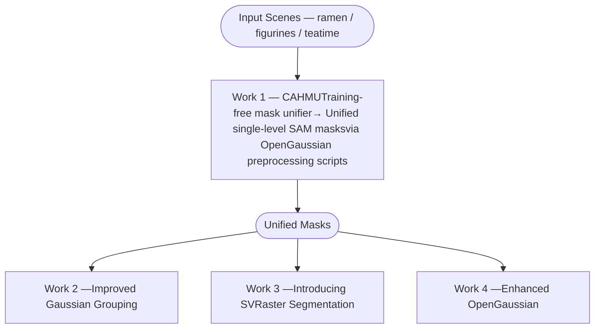

</div>

---

## Datasets and Evaluation

All experiments are conducted exclusively on the **LeRF-OVS** dataset from [LERF](https://arxiv.org/abs/2303.09553) [[11]](#references) (Language Embedded Radiance Fields), comprising three real-world tabletop scenes captured with the Polycam application: `figurines`, `teatime`, and `ramen`.

### Dataset Download

We have expanded upon the original LeRF-OVS collection and also provide the corresponding COLMAP data sourced from the [LangSplat](https://arxiv.org/abs/2312.16084) [[5]](#references) repository. All scenes used in this thesis — `figurines`, `ramen`, and `teatime` — are included.

> 📦 **[Download Expanded LERF Dataset and COLMAP Data](https://drive.google.com/file/d/1QF1Po5p5DwTjFHu6tnTeYs_G0egMVmHt/view?usp=sharing)**

If you prefer to skip the preprocessing steps entirely, fully preprocessed datasets are also available for direct download:

> 🗂️ **[Download Preprocessed Dataset — Works 2 & 3](https://drive.google.com/file/d/1pnp4LDTLRCmQgm3-XNj7dpqm4nTURihA/view?usp=sharing)** — includes scene images, COLMAP data, and all prepared SAM mask folders for `modified-gaussian-grouping/data/` (reused by `modified-svraster/data/`)

> 🗂️ **[Download Preprocessed Dataset — Work 4](https://drive.google.com/file/d/18ymU_tpFczdMf0N4k-59BG5H5erGAIbF/view?usp=sharing)** — includes scene images, COLMAP data, and all generated SAM mask variants for `modified-OpenGaussian/data/lerf_ovs/`

After downloading, extract the archive and place the scenes in the appropriate directories for each work:

```
# For Works 2 and 3
modified-gaussian-grouping/data/ramen/
modified-gaussian-grouping/data/figurines/
modified-gaussian-grouping/data/teatime/

# For Work 4
modified-OpenGaussian/data/lerf_ovs/ramen/
modified-OpenGaussian/data/lerf_ovs/figurines/
modified-OpenGaussian/data/lerf_ovs/teatime/
```

### Scene Overview

| Scene | Training Frames | Object Density | Notable Objects |
|-------|----------------|---------------|-----------------|
| `ramen` | 1–131 (all) | Medium | nori, sake cup, kamaboko, corn, spoon, egg, chopsticks, wavy noodles, bowl, napkin, etc. |
| `figurines` | **1–250** ⚠️ | High | jake, pikachu, rubber duck, pirate hat, waldo, tesla door handle, porcelain hand, etc. |
| `teatime` | 1–180 (all) | Low–Medium | sheep, stuffed bear, coffee mug, cookies, apple, yellow pouf, dall-e brand, etc. |

> ⚠️ **Figurines frame limit — use frames 1–250 only (all Works).**
> [DEVA](https://arxiv.org/abs/2309.03903) [[6]](#references) (Tracking Anything with Decoupled Video Segmentation, [[code]](https://github.com/hkchengrex/Tracking-Anything-with-DEVA)) is used in the preprocessing pipeline of Works 2 & 3 to assign multi-view-consistent object identities to SAM masks (same object → same ID across views). DEVA encodes these IDs as `short` integers, which hard-caps the number of simultaneously trackable identities at **256**. The `figurines` scene spans frames 1–301; processing all 301 frames exhausts this capacity mid-sequence, corrupting identity maps in later frames across every SAM mask configuration. **Restrict the `figurines` training set to frames 1–250 for all Works.** The `ramen` (1–131) and `teatime` (1–180) scenes fall within the safe limit and are used in their entirety.

### Fixed Evaluation Frames and Queries

Evaluation frames and text queries are fixed per scene across **all experiments** to ensure strictly comparable conditions.

- **ramen** queries: `nori`, `sake cup`, `kamaboko`, `corn`, `spoon`, `egg`, `onion segments`, `plate`, `napkin`, `bowl`, `glass of water`, `chopsticks`, `wavy noodles`
  — frames: 00006, 00024, 00060, 00065, 00081, 00119, 00128
- **figurines** queries: `jake`, `pirate hat`, `pikachu`, `rubber duck with hat`, `porcelain hand`, `red apple`, `tesla door handle`, `waldo`, `bag`, `toy cat statue`, `miffy`, `green apple`, `pumpkin`, `rubics cube`, `old camera`, `rubber duck with buoy`, `red toy chair`, `pink ice cream`, `spatula`, `green toy chair`, `toy elephant`
  — frames: 00041, 00105, 00152, 00195
- **teatime** queries: `sheep`, `yellow pouf`, `stuffed bear`, `coffee mug`, `tea in a glass`, `apple`, `coffee`, `hooves`, `bear nose`, `dall-e brand`, `plate`, `paper napkin`, `three cookies`, `bag of cookies`
  — frames: 00002, 00025, 00043, 00107, 00129, 00140

### Hardware Requirements

| Work | Scene | GPU |
|------|-------|-----|
| Work 2 | figurines, ramen | NVIDIA A6000 48 GB |
| Work 2 | teatime | NVIDIA A100 80 GB |
| Work 3 | all scenes | NVIDIA A100 80 GB |
| Work 4 | all scenes | NVIDIA A6000 48 GB |

---

## Prerequisites

All three codebases share the following common requirements:

- **CUDA 12.1** (`nvidia/label/cuda-12.1.0`)
- **Conda** (Miniconda or Anaconda)
- **GCC / G++** available at `/usr/bin/gcc` and `/usr/bin/g++`
- **GPU architecture flags:** `8.0` (A100) and/or `8.6` (A6000 / RTX 3090)

> ⚠️ Each work uses its own isolated conda environment. Do **not** share environments across works.

---

## Work 1 — CAHMU: Context-Aware Hierarchical Mask Unifier

**CAHMU** is a **training-free** preprocessing module. It resolves the granularity conflicts in multi-level [SAM](https://arxiv.org/abs/2304.02643) [[7]](#references) outputs using [CLIP](https://arxiv.org/abs/2103.00020) [[10]](#references)-driven objectness scoring, producing a clean, instance-discriminative single-level mask set. These unified masks serve as supervision for Works 2 and 4.

Work 1 mask generation is embedded inside the **OpenGaussian runner** (`runner_of_OpenGaussian.sh`). The relevant script is `preprocess_sam_u.py`, which runs the full CAHMU-unified SAM pipeline.

### Algorithm Overview

CAHMU operates in three sequential phases. Phase 1 performs top-down subdivision: per-mask objectness *o(m)*, complexity *κ(m)*, and HS-histogram appearance *h(m)* are extracted; large-level SAM masks are selectively replaced by their medium-level children when child appearance diversity satisfies a dynamic threshold. Phase 2 recovers medium-level and small-level orphan masks that occupy uncovered foreground regions (vacuum overlap ratio *r(m) < 0.5*) &  resolves residual spatial overlaps by painting in ascending objectness order, so higher-objectness masks take unconditional spatial priority.

<p align="center">
  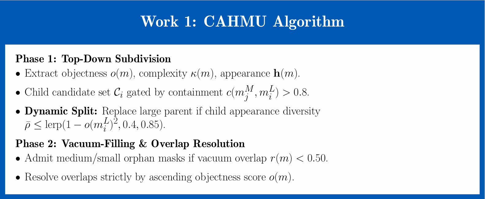
</p>
<p align="center"><em>Figure 1 — CAHMU algorithm summary: Phase 1 — top-down subdivision gated by objectness, complexity, and child appearance diversity; Phase 2 — vacuum-filling for orphan masks & objectness-priority overlap resolution.</em></p>

### Step-by-step

Navigate into `modified-OpenGaussian/` and run the following (also covered by `runner_of_OpenGaussian.sh`):

```bash
cd modified-OpenGaussian

# 1. Create and activate the environment
conda env create -f environment.yml
conda activate open_gaussian

# 2. Install CUDA toolkit and build tools
conda install -c "nvidia/label/cuda-12.1.0" cuda-toolkit -y
pip install ninja
export CC=/usr/bin/gcc
export CXX=/usr/bin/g++
export TORCH_CUDA_ARCH_LIST="8.0;8.6"

# 3. Install submodules
pip install --no-build-isolation submodules/ashawkey-diff-gaussian-rasterization
pip install --no-build-isolation "git+https://github.com/facebookresearch/pytorch3d.git"
pip install --no-build-isolation submodules/sam-langsplat
pip install --no-build-isolation submodules/sam-hq

# 4. Unzip text features
cd assets && unzip text_features.zip && cd ..

# 5. Set up ckpts/ folder — copy SAM checkpoints from Work 2 or Work 3 (see Work 4 setup)
#    ckpts/sam_hq_vit_h.pth
#    ckpts/sam_vit_h_4b8939.pth

# 6. Generate CAHMU-Unified SAM masks (Work 1 output) for each scene
python preprocess_sam_u.py --dataset_path data/lerf_ovs/ramen
python preprocess_sam_u.py --dataset_path data/lerf_ovs/ramen --crop

python preprocess_sam_u.py --dataset_path data/lerf_ovs/figurines
python preprocess_sam_u.py --dataset_path data/lerf_ovs/figurines --crop

python preprocess_sam_u.py --dataset_path data/lerf_ovs/teatime
python preprocess_sam_u.py --dataset_path data/lerf_ovs/teatime --crop

# (Optional) Visualise the generated masks
python masks_visualizer.py --dataset_path data/lerf_ovs/ramen --variant sam_u
python masks_visualizer.py --dataset_path data/lerf_ovs/ramen --crop --variant sam_u
```

> The `--crop` flag generates masks from black-background cropped renders (used in crop-setting ablations for Work 4).

### CAHMU Key Thresholds

| Parameter | Value |
|-----------|-------|
| CLIP temperature τ | 25.0 |
| Containment ratio | > 0.8 |
| Complexity–objectness band (κ, o) | (0.45, 0.85) |
| Pairwise histogram-correlation gate | (0.25, 0.75) |
| Dynamic split threshold θ_split | [0.4, 0.85] |
| Foreground-canvas inclusion | o > 0.1 |
| Vacuum-overlap ratio | r < 0.5 |
| Min residual mask area | 50 px |

---

## Work 2 — Improved Gaussian Grouping

Work 2 augments the original [Gaussian Grouping](https://arxiv.org/abs/2312.00732) [[1]](#references) \[[code](https://github.com/lkeab/gaussian-grouping)\] framework with three novel loss terms applied over a [3D Gaussian Splatting (3DGS)](https://arxiv.org/abs/2308.04079) [[9]](#references) backbone:

- **Cont** — 2D + 3D contrastive loss: enforces intra-mask compactness and inter-mask separation in feature space
- **Hyp** — 2D + 3D hypersphere normalisation: prevents large feature-norm dominance during alpha-compositing
- **GST** — KL distillation via Gaussian Semantic Tracing: replaces hard multi-view labels with soft probabilistic KL distillation

**Best configuration: Exp 8** — CAHMU-unified masks on original images + Hyp loss → **41.72% mean mIoU**

### Feature Optimisation Architecture (Works 2 & 3)

The three modifications are stacked sequentially on top of the original backbone. The same architecture is shared between Works 2 (Gaussian-Grouping backbone) and 3 (SVRaster backbone), with the Gaussian Semantic Tracing (GST) loss replaced by the analogous Voxel Semantic Tracing (VST) loss in Work 3.

<p align="center">
  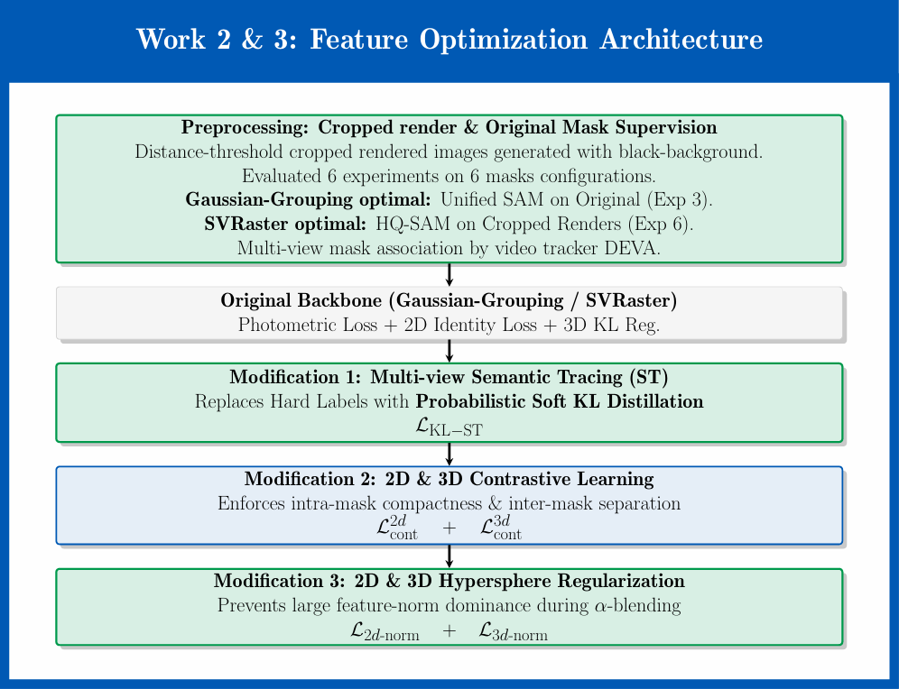
</p>
<p align="center"><em>Figure 2 — Feature optimisation architecture shared by Works 2 and 3. Preprocessing supplies cropped black-background rendered and original mask supervision. Modification 1 adds Multi-view Semantic Tracing with Probabilistic KL Distillation (ℒ<sub>KL–ST</sub>), retained in the best configuration for Work 3. Modification 2 adds 2D & 3D Contrastive Learning. Modification 3 adds 2D & 3D Hypersphere Regularisation, retained in the best configuration for Work 2. For Work 3, the Gaussian-Grouping backbone is replaced by SVRaster and GST is correspondingly replaced by VST; all other components are unchanged. Steps shown in green are adopted into the final configuration of the respective Works; steps shown in blue were evaluated but found a little detrimental and reverted to the baseline.</em></p>

### Installation

```bash
cd modified-gaussian-grouping

conda env create -f environment.yml
conda activate my_gaussian_grouping

conda install -c "nvidia/label/cuda-12.1.0" cuda-toolkit -y
pip install ninja
export CC=/usr/bin/gcc
export CXX=/usr/bin/g++
export TORCH_CUDA_ARCH_LIST="8.0;8.6"

pip install --no-build-isolation ./submodules/diff-gaussian-rasterization
pip install --no-build-isolation ./submodules/simple-knn
pip install --no-build-isolation ./submodules/fused-ssim
pip install --no-build-isolation ./submodules/GroundingDINO      # GroundingDINO [12]
pip install --no-build-isolation ./submodules/deva               # DEVA [6]
pip install --no-build-isolation ./submodules/sam-hq             # SAM-HQ [8]
pip install --no-build-isolation ./submodules/depth-anything-v2  # Depth Anything V2 [13]

# Download segmentation model checkpoints into checkpoints/
bash script/download_models.sh
```

### GroundingDINO Config File

> ⚠️ The `wget` approach for the GroundingDINO config does not download the raw file correctly from GitHub. **Download the file manually** from the link below and place it in the `config/` folder:

1. Open: [https://github.com/IDEA-Research/GroundingDINO/blob/main/groundingdino/config/GroundingDINO_SwinB_cfg.py](https://github.com/IDEA-Research/GroundingDINO/blob/main/groundingdino/config/GroundingDINO_SwinB_cfg.py)
2. Click **Raw** and save the file as `GroundingDINO_SwinB_cfg.py`
3. Place it at:

```
modified-gaussian-grouping/config/GroundingDINO_SwinB_cfg.py
```

### Step 1 — Convert JSON annotations to masks

```bash
python json_to_masks.py --data_dir data/label/ramen
python json_to_masks.py --data_dir data/label/figurines
python json_to_masks.py --data_dir data/label/teatime
```

### Step 2 — Prepare pseudo-labels (mask supervision)

Six mask variants are prepared per scene by crossing three mask types × two image sources. Masks are generated using [SAM](https://arxiv.org/abs/2304.02643) [[7]](#references) (default and CAHMU-unified) and [SAM-HQ](https://arxiv.org/abs/2306.01567) [[8]](#references):

```bash
# ramen
bash script/prepare_pseudo_label.sh ramen 1 sam
bash script/prepare_pseudo_label.sh ramen 1 sam_hq
bash script/prepare_pseudo_label.sh ramen 1 sam_unified
bash script/prepare_pseudo_label.sh ramen crop sam
bash script/prepare_pseudo_label.sh ramen crop sam_hq
bash script/prepare_pseudo_label.sh ramen crop sam_unified

# figurines
bash script/prepare_pseudo_label.sh figurines 1 sam
bash script/prepare_pseudo_label.sh figurines 1 sam_hq
bash script/prepare_pseudo_label.sh figurines 1 sam_unified
bash script/prepare_pseudo_label.sh figurines crop sam
bash script/prepare_pseudo_label.sh figurines crop sam_hq
bash script/prepare_pseudo_label.sh figurines crop sam_unified

# teatime
bash script/prepare_pseudo_label.sh teatime 1 sam
bash script/prepare_pseudo_label.sh teatime 1 sam_hq
bash script/prepare_pseudo_label.sh teatime 1 sam_unified
bash script/prepare_pseudo_label.sh teatime crop sam
bash script/prepare_pseudo_label.sh teatime crop sam_hq
bash script/prepare_pseudo_label.sh teatime crop sam_unified
```

> **Note:** The preprocessing above generates all required mask folders (e.g. `object_mask_sam/`, `crop_object_mask_sam_hq/`, etc.) inside each scene directory under `data/`. These will be reused by Work 3 — see the [Work 3 data setup](#work-3-data-and-checkpoint-setup) section below.

### Step 3 — Train, render, and evaluate

**Mask-quality ablation** (Exps 1–6 per scene, no novel loss terms):

```bash
# ramen
bash script/train_render_eval.sh ramen output_sam              object_mask_sam               normal
bash script/train_render_eval.sh ramen output_crop_sam         crop_object_mask_sam          normal
bash script/train_render_eval.sh ramen output_sam_unified      object_mask_sam_unified       normal
bash script/train_render_eval.sh ramen output_crop_sam_unified crop_object_mask_sam_unified  normal
bash script/train_render_eval.sh ramen output_sam_hq           object_mask_sam_hq            normal
bash script/train_render_eval.sh ramen output_crop_sam_hq      crop_object_mask_sam_hq       normal
```

**Loss-function ablation — Unified-Original baseline** (Exps 7–10):

```bash
bash script/train_render_eval.sh ramen output_sam_unified_cos object_mask_sam_unified cos
bash script/train_render_eval.sh ramen output_sam_unified_hyp object_mask_sam_unified hyp
bash script/train_render_eval.sh ramen output_sam_unified_gst object_mask_sam_unified gst
bash script/train_render_eval.sh ramen output_sam_unified_all object_mask_sam_unified all
```

**Loss-function ablation — HQ-SAM Cropped baseline** (Exps 11–14):

```bash
bash script/train_render_eval.sh ramen output_crop_sam_hq_cos crop_object_mask_sam_hq cos
bash script/train_render_eval.sh ramen output_crop_sam_hq_hyp crop_object_mask_sam_hq hyp
bash script/train_render_eval.sh ramen output_crop_sam_hq_gst crop_object_mask_sam_hq gst
bash script/train_render_eval.sh ramen output_crop_sam_hq_all crop_object_mask_sam_hq all
```

> Repeat all `train_render_eval.sh` calls above for `figurines` and `teatime` by substituting the scene name. See `runner_of_gaussian-grouping.sh` for the complete command listing.

### Training Hyperparameters

| Parameter | Value |
|-----------|-------|
| Iterations | 30,000 |
| Optimizer | Adam (default 3DGS schedule) |
| Identity feature classes | 256 |
| λ_GST | 50 |
| λ²ᵈ_cont | 5×10⁻⁴ |
| λ³ᵈ_cont | 2×10⁻² |
| λ²ᵈ_hyp | 10⁻³ |
| λ³ᵈ_hyp | 10⁻³ |
| GST update interval | 100 iters |
| GST views per update | 20 |

---

## Work 3 — Segmentation over Sparse Voxel Rasterization (SVRaster)

Work 3 introduces the **first end-to-end object-feature learning pipeline over** [SVRaster](https://arxiv.org/abs/2409.12512) [[3]](#references) \[[code](https://github.com/theialab/svraster)\], requiring new per-voxel object features and semantic-tracing weights to be added directly to the CUDA rasteriser. The novel **Voxel Semantic Tracing (VST)** loss provides soft probabilistic KL distillation of multi-view semantic consistency. The feature optimisation architecture is shared with Work 2 — see [Figure 2](#feature-optimisation-architecture-works-2--3) above.

**Best configuration: Exp 13** — HQ-SAM on cropped renders + VST loss → **45.53% mean mIoU**

### Installation

```bash
cd modified-svraster

conda env create -f environment.yml
conda activate svraster

conda install -c "nvidia/label/cuda-12.1.0" cuda-toolkit -y
pip install ninja
export CC=/usr/bin/gcc
export CXX=/usr/bin/g++
export TORCH_CUDA_ARCH_LIST="8.0;8.6"

pip install --no-build-isolation ./cuda/
pip install --no-build-isolation ./fused-ssim/
pip install --no-build-isolation ./GroundingDINO/  # GroundingDINO [12]
pip install --no-build-isolation ./sam-hq/         # SAM-HQ [8]
```

### GroundingDINO Config File

> ⚠️ Same as Work 2 — **download the raw config file manually** from GitHub and place it in the `cfg/` folder. The simplest approach is to copy it directly from Work 2:

```bash
# From the repository root
cp modified-gaussian-grouping/config/GroundingDINO_SwinB_cfg.py \
   modified-svraster/cfg/GroundingDINO_SwinB_cfg.py
```

Alternatively, download it manually from:
[https://github.com/IDEA-Research/GroundingDINO/blob/main/groundingdino/config/GroundingDINO_SwinB_cfg.py](https://github.com/IDEA-Research/GroundingDINO/blob/main/groundingdino/config/GroundingDINO_SwinB_cfg.py)

### Work 3 Data and Checkpoint Setup

The data preprocessing step for Work 3 is **identical** to Work 2. Once you have completed the preprocessing steps in Work 2, **copy the entire `data/` folder** directly into Work 3 instead of re-running preprocessing:

```bash
# From the repository root — copy Work 2 data (with all prepared masks) to Work 3
cp -r modified-gaussian-grouping/data modified-svraster/data
```

Work 3 also requires a `checkpoints/` folder containing three model weight files. Copy them from Work 2's `checkpoints/` folder (populated by `download_models.sh`):

```bash
# From the repository root
mkdir -p modified-svraster/checkpoints

cp modified-gaussian-grouping/checkpoints/groundingdino_swinb_cogcoor.pth \
   modified-svraster/checkpoints/

cp modified-gaussian-grouping/checkpoints/sam_hq_vit_h.pth \
   modified-svraster/checkpoints/

cp modified-gaussian-grouping/checkpoints/sam_vit_h_4b8939.pth \
   modified-svraster/checkpoints/
```

After these steps, the `modified-svraster/` directory should have:

```
modified-svraster/
├── checkpoints/
│   ├── groundingdino_swinb_cogcoor.pth
│   ├── sam_hq_vit_h.pth
│   └── sam_vit_h_4b8939.pth
├── cfg/
│   └── GroundingDINO_SwinB_cfg.py
└── data/
    ├── ramen/         (with all prepared mask folders)
    ├── figurines/
    └── teatime/
```

### Train, render, and evaluate

The `train_render_eval.sh` script for SVRaster takes an additional per-scene **bound scale** argument controlling foreground scene isolation:

| Scene | Bound Scale |
|-------|-------------|
| `ramen` | 1.5 |
| `figurines` | 0.025 |
| `teatime` | 1.0 |

**Mask-quality ablation** (Exps 1–6):

```bash
# ramen (bound scale = 1.5)
bash scripts/train_render_eval.sh ramen output_sam              object_mask_sam               normal 1.5
bash scripts/train_render_eval.sh ramen output_crop_sam         crop_object_mask_sam          normal 1.5
bash scripts/train_render_eval.sh ramen output_sam_unified      object_mask_sam_unified       normal 1.5
bash scripts/train_render_eval.sh ramen output_crop_sam_unified crop_object_mask_sam_unified  normal 1.5
bash scripts/train_render_eval.sh ramen output_sam_hq           object_mask_sam_hq            normal 1.5
bash scripts/train_render_eval.sh ramen output_crop_sam_hq      crop_object_mask_sam_hq       normal 1.5
```

**Loss-function ablation — Unified-Original baseline** (Exps 7–10):

> ⚠️ **Exps 9 and 10** use the VST loss or the combined loss (+Cont+Hyp+VST), which significantly increases memory consumption. To avoid GPU OOM, set `subdivide_until = 12000` and `prune_until = 15000` in the `src/config.py` file for the training of these experiments.

```bash
bash scripts/train_render_eval.sh ramen output_sam_unified_cos object_mask_sam_unified cos 1.5
bash scripts/train_render_eval.sh ramen output_sam_unified_hyp object_mask_sam_unified hyp 1.5

# Exp 9 — VST only: use subdivide_until=12000 to avoid GPU memory overflow
bash scripts/train_render_eval.sh ramen output_sam_unified_vst object_mask_sam_unified vst 1.5

# Exp 10 — All losses (+Cont+Hyp+VST): use subdivide_until=12000 to avoid GPU memory overflow
bash scripts/train_render_eval.sh ramen output_sam_unified_all object_mask_sam_unified all 1.5
```

**Loss-function ablation — HQ-SAM Cropped baseline** (Exps 11–14):

> ⚠️ **Exps 13 and 14** follow the same memory constraint. Set `subdivide_until = 12000` and `prune_until = 15000` in the `src/config.py` file for the training of these experiments.

```bash
bash scripts/train_render_eval.sh ramen output_crop_sam_hq_cos  crop_object_mask_sam_hq cos 1.5
bash scripts/train_render_eval.sh ramen output_crop_sam_hq_hyp  crop_object_mask_sam_hq hyp 1.5

# Exp 13 — VST only: use subdivide_until=12000 to avoid GPU memory overflow
bash scripts/train_render_eval.sh ramen output_crop_sam_hq_vst  crop_object_mask_sam_hq vst 1.5

# Exp 14 — All losses (+Cont+Hyp+VST): use subdivide_until=12000 to avoid GPU memory overflow
bash scripts/train_render_eval.sh ramen output_crop_sam_hq_all  crop_object_mask_sam_hq all 1.5
```

> Repeat all commands with `figurines` (bound scale `0.025`) and `teatime` (bound scale `1`). See `runner_of_svraster.sh` for the full command listing.

### Training Hyperparameters

| Parameter | Value |
|-----------|-------|
| Iterations | 20,000 |
| Voxel pruning until | **15,000 iters** (vst / all — Exps 9, 10, 13, 14) |
| Voxel pruning until | 18,000 iters (normal / cos / hyp — all other Exps) |
| Voxel subdivision until | **12,000 iters** (vst / all — Exps 9, 10, 13, 14) |
| Voxel subdivision until | 15,000 iters (normal / cos / hyp — all other Exps) |
| num_objects (bits per dim) | 16 |
| num_classes | 256 |
| sh_objs_lr | 0.010 |
| λ²ᵈ | 0.05 |
| λ³ᵈ | 0.2 |
| λ_VST | 50 |
| λ²ᵈ_cont | 2×10⁻⁵ |
| λ³ᵈ_cont | 10⁻³ |
| λ²ᵈ_hyp | 5×10⁻⁵ |
| λ³ᵈ_hyp | 5×10⁻⁵ |
| VST update interval | 50 iters |
| VST views per update | 20 |

---

## Work 4 — Enhanced OpenGaussian

Work 4 builds on [OpenGaussian](https://arxiv.org/abs/2406.02058) [[2]](#references) \[[code](https://github.com/muedavid/OpenGaussian)\] with a systematic evaluation of mask supervision quality and scene-cropping strategies for language-guided 3D segmentation. The two-phase training schedule (geometry + colour-features first, then language/object features) is retained from the original. Three candidate modifications are evaluated:

1. **Modified Preprocessing** — CAHMU-unified masks (Exp 7) replace large-level SAM masks as the LangSplat CLIP feature source. *Adopted.*
2. **Objectness-based Cluster Pruning** — Periodically scores and prunes low-objectness coarse clusters during Stage 2.1. *Found detrimental (−19.2% mIoU); baseline retained.*
3. **Two-Stage Text-Query Re-ranking** — Top-10 cosine shortlist re-ranked by query-conditioned rendered objectness; top-5 retained. *Found detrimental (−29.4% mIoU); single-pass cosine retained.*

**Best configuration: Exp 7** — CAHMU-unified SAM on original images, no cropping → **59.02% mean mIoU** (new state-of-the-art on LeRF-OVS)

### Pipeline Overview

<p align="center">
  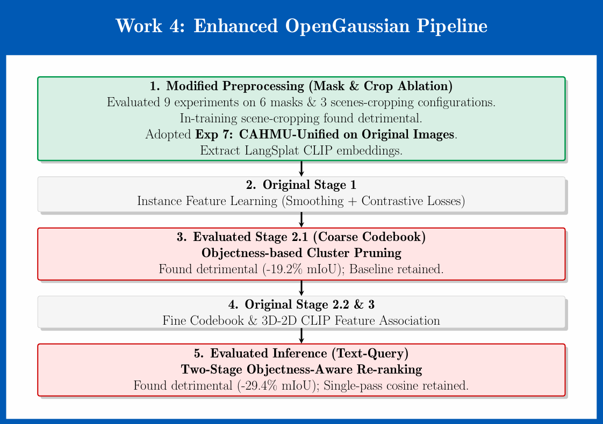
</p>
<p align="center"><em>Figure 3 — Enhanced OpenGaussian pipeline for Work 4. Steps shown in green are adopted into the final configuration; steps shown in red were evaluated but found detrimental and reverted to the baseline. CAHMU-unified preprocessing (Exp 7) is the only modification retained in the best configuration.</em></p>

### Installation

> The conda environment for Work 4 is the same as Work 1 (`open_gaussian`). If Work 1 was already set up, **skip the installation steps** and proceed directly to the checkpoint setup and training.

```bash
cd modified-OpenGaussian

conda env create -f environment.yml
conda activate open_gaussian

conda install -c "nvidia/label/cuda-12.1.0" cuda-toolkit -y
pip install ninja
export CC=/usr/bin/gcc
export CXX=/usr/bin/g++
export TORCH_CUDA_ARCH_LIST="8.0;8.6"

pip install --no-build-isolation submodules/ashawkey-diff-gaussian-rasterization
pip install --no-build-isolation "git+https://github.com/facebookresearch/pytorch3d.git"
pip install --no-build-isolation submodules/sam-langsplat  # SAM [7] variant used by LangSplat [5]
pip install --no-build-isolation submodules/sam-hq         # SAM-HQ [8]

cd assets && unzip text_features.zip && cd ..
```

### Work 4 Checkpoint Setup

Work 4 requires a `ckpts/` folder containing two SAM model weights. Copy them from Work 2's (or Work 3's) `checkpoints/` folder:

```bash
# From the repository root
mkdir -p modified-OpenGaussian/ckpts

cp modified-gaussian-grouping/checkpoints/sam_hq_vit_h.pth \
   modified-OpenGaussian/ckpts/

cp modified-gaussian-grouping/checkpoints/sam_vit_h_4b8939.pth \
   modified-OpenGaussian/ckpts/
```

After this step the `ckpts/` folder should contain:

```
modified-OpenGaussian/ckpts/
├── sam_hq_vit_h.pth
└── sam_vit_h_4b8939.pth
```

### Step 1 — Generate all mask variants

```bash
# ramen
python preprocess_sam_l.py  --dataset_path data/lerf_ovs/ramen
python preprocess_sam_l.py  --dataset_path data/lerf_ovs/ramen --crop
python preprocess_sam_hq.py --dataset_path data/lerf_ovs/ramen
python preprocess_sam_hq.py --dataset_path data/lerf_ovs/ramen --crop
python preprocess_sam_u.py  --dataset_path data/lerf_ovs/ramen          # CAHMU (Work 1)
python preprocess_sam_u.py  --dataset_path data/lerf_ovs/ramen --crop

# figurines
python preprocess_sam_l.py  --dataset_path data/lerf_ovs/figurines
python preprocess_sam_l.py  --dataset_path data/lerf_ovs/figurines --crop
python preprocess_sam_hq.py --dataset_path data/lerf_ovs/figurines
python preprocess_sam_hq.py --dataset_path data/lerf_ovs/figurines --crop
python preprocess_sam_u.py  --dataset_path data/lerf_ovs/figurines
python preprocess_sam_u.py  --dataset_path data/lerf_ovs/figurines --crop

# teatime
python preprocess_sam_l.py  --dataset_path data/lerf_ovs/teatime
python preprocess_sam_l.py  --dataset_path data/lerf_ovs/teatime --crop
python preprocess_sam_hq.py --dataset_path data/lerf_ovs/teatime
python preprocess_sam_hq.py --dataset_path data/lerf_ovs/teatime --crop
python preprocess_sam_u.py  --dataset_path data/lerf_ovs/teatime
python preprocess_sam_u.py  --dataset_path data/lerf_ovs/teatime --crop
```

### Step 2 — Train the full-scene 3DGS geometry

```bash
python train_normal.py -s data/lerf_ovs/ramen     -m output_full_scene/ramen     --iterations 30_000
python train_normal.py -s data/lerf_ovs/figurines -m output_full_scene/figurines --iterations 30_000
python train_normal.py -s data/lerf_ovs/teatime   -m output_full_scene/teatime   --iterations 30_000
```

### Step 3 — (Optional) Crop scene for Crop@30k / Cropped-Render experiments

> Only needed for Exps 2, 3, 5, 6, 8, 9 (cropped-render and Crop@30k settings).

```bash
# ramen (padding = 1.5)
cp -r output_full_scene/ramen output/ramen
python crop_scene.py  -m output/ramen --iteration 30000 --padding 1.5
python crop_images.py -m output/ramen --iteration 30000

# figurines (padding = 0.025)
cp -r output_full_scene/figurines output/figurines
python crop_scene.py  -m output/figurines --iteration 30000 --padding 0.025
python crop_images.py -m output/figurines --iteration 30000

# teatime (padding = 1.0)
cp -r output_full_scene/teatime output/teatime
python crop_scene.py  -m output/teatime --iteration 30000 --padding 1
python crop_images.py -m output/teatime --iteration 30000
```

### Step 4 — Mask & cropping ablation (Exps 1–9)

All commands follow the pattern:

```bash
cp -r <geometry_source>/<scene> <output_dir>/<scene>
bash scripts/train_render_eval.sh <scene> <output_dir> <feature_dir> <mode> <checkpoint>
```

**ramen — nine configurations (repeat analogously for `figurines` and `teatime`):**

```bash
# Exp 1: Large SAM, original image
cp -r output_full_scene/ramen output_sam_l_full_scene/ramen
bash scripts/train_render_eval.sh ramen output_sam_l_full_scene language_features_sam_l normal chkpnt30000

# Exp 2: Large SAM, cropped render (no in-training crop)
cp -r output_full_scene/ramen output_crop_sam_l_full_scene/ramen
bash scripts/train_render_eval.sh ramen output_crop_sam_l_full_scene crop_language_features_sam_l normal chkpnt30000

# Exp 3: Large SAM, Crop@30k
cp -r output/ramen output_crop_sam_l/ramen
bash scripts/train_render_eval.sh ramen output_crop_sam_l crop_language_features_sam_l normal chkpnt30000

# Exp 4: HQ-SAM, original image
cp -r output_full_scene/ramen output_sam_hq_full_scene/ramen
bash scripts/train_render_eval.sh ramen output_sam_hq_full_scene language_features_sam_hq normal chkpnt30000

# Exp 5: HQ-SAM, cropped render
cp -r output_full_scene/ramen output_crop_sam_hq_full_scene/ramen
bash scripts/train_render_eval.sh ramen output_crop_sam_hq_full_scene crop_language_features_sam_hq normal chkpnt30000

# Exp 6: HQ-SAM, Crop@30k
cp -r output/ramen output_crop_sam_hq/ramen
bash scripts/train_render_eval.sh ramen output_crop_sam_hq crop_language_features_sam_hq normal chkpnt30000

# Exp 7: CAHMU-Unified SAM, original image  ← BEST overall configuration
cp -r output_full_scene/ramen output_sam_u_full_scene/ramen
bash scripts/train_render_eval.sh ramen output_sam_u_full_scene language_features_sam_u normal chkpnt30000

# Exp 8: CAHMU-Unified SAM, cropped render
cp -r output_full_scene/ramen output_crop_sam_u_full_scene/ramen
bash scripts/train_render_eval.sh ramen output_crop_sam_u_full_scene crop_language_features_sam_u normal chkpnt30000

# Exp 9: CAHMU-Unified SAM, Crop@30k  ← Operating baseline for ramen training/inference ablations
cp -r output/ramen output_crop_sam_u/ramen
bash scripts/train_render_eval.sh ramen output_crop_sam_u crop_language_features_sam_u normal chkpnt30000
```

> Repeat the nine configurations for `figurines` and `teatime`. Padding values for `crop_scene.py`: `1.5` (ramen), `0.025` (figurines), `1.0` (teatime). See `runner_of_OpenGaussian.sh` for the complete listing.

### Step 5 — Training-method ablation (ramen only, Exps 11, 13, 15)

> Baseline is Exp 9 (Unified SAM, Crop@30k). Evaluated on ramen scene only; configurations observed to be clearly detrimental were not extended to other scenes.

```bash
# Exp 11: + Cluster Pruning (CP)
cp -r output_crop_sam_u/ramen output_crop_sam_u_prune/ramen
bash scripts/train_render_eval.sh ramen output_crop_sam_u_prune crop_language_features_sam_u prune chkpnt40000
python render_lerf_by_text.py -m output_crop_sam_u_prune/ramen --scene_name ramen --skip_test
python scripts/eval_lerf_mask_new.py --out_dir output_crop_sam_u_prune/ramen --split train

# Exp 13: + filter=False (NF)
cp -r output_crop_sam_u/ramen output_crop_sam_u_no_filter/ramen
bash scripts/train_render_eval.sh ramen output_crop_sam_u_no_filter crop_language_features_sam_u no_filter chkpnt40000
python render_lerf_by_text.py -m output_crop_sam_u_no_filter/ramen --scene_name ramen --skip_test
python scripts/eval_lerf_mask_new.py --out_dir output_crop_sam_u_no_filter/ramen --split train

# Exp 15: + CP + NF
cp -r output_crop_sam_u/ramen output_crop_sam_u_all/ramen
bash scripts/train_render_eval.sh ramen output_crop_sam_u_all crop_language_features_sam_u all chkpnt40000
python render_lerf_by_text.py -m output_crop_sam_u_all/ramen --scene_name ramen --skip_test
python scripts/eval_lerf_mask_new.py --out_dir output_crop_sam_u_all/ramen --split train
```

### Step 6 — Inference re-ranking ablation (Exps 10, 12, 14, 16)

Inference re-ranking (two-stage: top-10 cosine → top-5 objectness re-rank) is invoked via `render_lerf_by_text.py` and `eval_lerf_mask_new.py` on top of each training configuration. Refer to the commented-out commands at the bottom of `runner_of_OpenGaussian.sh` for the full invocation sequence.

### Training Hyperparameters

| Parameter | Value |
|-----------|-------|
| Total iterations | 70,000 |
| Phase 1 — geometry + colour features | 1 – 30,000 |
| Phase 2 — object features | 30,001 – 70,000 |
| Cluster-pruning threshold θ_prune | 0.2 |
| Pruning interval | every 1,000 iters (Stage 2.1) |
| Re-ranking: cosine shortlist K₁ | 10 |
| Re-ranking: objectness shortlist K₂ | 5 |
| Feature-proximity threshold δ | 0.9 |
| Scene cropping multiplier β | 1.5 |

---

## Evaluation Metrics

All experiments are evaluated using a unified evaluation script reporting six complementary metrics:

| Metric | Description |
|--------|-------------|
| **mIoU** | Mean Intersection-over-Union over all image–query pairs |
| **mBIoU** | Mean Boundary IoU (dilation ratio 0.02 × image diagonal) — boundary precision |
| **IoU Acc@0.25** | Fraction of query–image pairs with IoU > 0.25 |
| **IoU Acc@0.5** | Fraction of query–image pairs with IoU > 0.5 |
| **BIoU Acc@0.25** | Fraction of query–image pairs with BIoU > 0.25 |
| **BIoU Acc@0.5** | Fraction of query–image pairs with BIoU > 0.5 |

---

## Results

### Cross-Method Comparison (Best Configurations)

| Method | Mean mIoU ↑ | Mean mBIoU ↑ | IoU Acc@.25 ↑ | IoU Acc@.5 ↑ |
|--------|:-----------:|:------------:|:-------------:|:------------:|
| **Work 2** — Improved Gaussian Grouping (Exp 8) | 41.72 | 38.09 | 50.69 | 43.35 |
| **Work 3** — SVRaster + VST (Exp 13) | 45.53 | 42.65 | 54.81 | 47.18 |
| **Work 4** — Enhanced OpenGaussian (Exp 7) | **59.02** | **54.69** | **77.16** | **68.19** |

### Comparison with State-of-the-Art

| Method | Mean mIoU ↑ | Mean mBIoU ↑ | IoU Acc@.25 ↑ | IoU Acc@.5 ↑ |
|--------|:-----------:|:------------:|:-------------:|:------------:|
| [LangSplat](https://arxiv.org/abs/2312.16084) [[5]](#references) | 10.45 | 10.05 | 14.95 | 6.50 |
| [LEGaussians](https://arxiv.org/abs/2311.18482) [[4]](#references) | 17.85 | 16.90 | 26.65 | 11.45 |
| [Gaussian Grouping](https://arxiv.org/abs/2312.00732) [[1]](#references) | 36.04 | 33.40 | 44.46 | 36.65 |
| **Work 2 (Ours)** | 41.72 | 38.09 | 50.69 | 43.35 |
| **Work 3 (Ours)** | 45.53 | 42.65 | 54.81 | 47.18 |
| [OpenGaussian](https://arxiv.org/abs/2406.02058) [[2]](#references) | 53.77 | 49.89 | 69.54 | 59.01 |
| **Work 4 (Ours) ★** | **59.02** | **54.69** | **77.16** | **68.19** |

★ New state-of-the-art on LeRF-OVS. Work 4 exceeds the previous best (OpenGaussian) by **+5.25% mean mIoU** and **+9.18% IoU Acc@0.5**.

---

### Ablation Results

The following charts summarise the key per-scene and mean mIoU comparisons from the ablation studies. Each chart isolates a single design choice — mask type, loss term, training modification, or inference strategy — to make the contribution of each component directly legible.

---

#### Work 2 — Gaussian Grouping Ablations

**Mask-quality ablation:** CAHMU-Unified SAM masks (Exp 3) consistently outperform Default-level SAM masks (Exp 1) across all three scenes, with the largest gain on Ramen (+9.27%). The +5.08% mean mIoU improvement confirms that resolving multi-level SAM granularity conflicts is the primary performance driver on the Gaussian backbone.

<p align="center">
  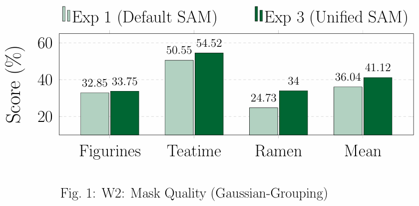
</p>
<p align="center"><em>Figure 4 — Work 2 mask-quality ablation: Default SAM (Exp 1) vs. CAHMU-Unified SAM (Exp 3). All other training settings are held fixed. Mean mIoU: 36.04% → 41.12% (+5.08%).</em></p>

**Loss-function ablation:** Among the three novel loss terms, Hypersphere Normalisation (Exp 8) provides the most consistent single-term gain over the CAHMU-unified baseline (+0.60% mean mIoU, +1.65% on IoU Acc@0.5). The overall margin is modest, confirming that supervision quality dominates over loss design on this backbone.

<p align="center">
  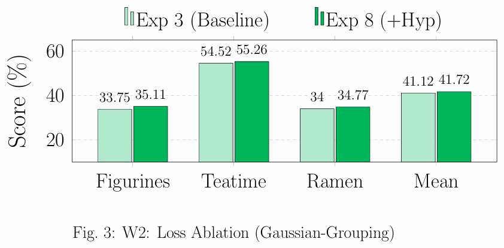
</p>
<p align="center"><em>Figure 5 — Work 2 loss-function ablation: Exp 3 baseline vs. Exp 8 (+Hyp). Hypersphere normalisation yields consistent per-scene improvements. Mean mIoU: 41.12% → 41.72% (+0.60%).</em></p>

---

#### Work 3 — SVRaster Ablations

**Mask-quality ablation:** The SVRaster backbone exhibits a strikingly different mask preference from the Gaussian-Grouping backbone. HQ-SAM on cropped renders (Exp 6) dominates all configurations by a clear margin, outperforming Default SAM (Exp 1) by +5.39% mean mIoU. The voxel rasteriser's explicit depth-ordering amplifies boundary precision, making HQ-SAM the most effective supervision source here.

<p align="center">
  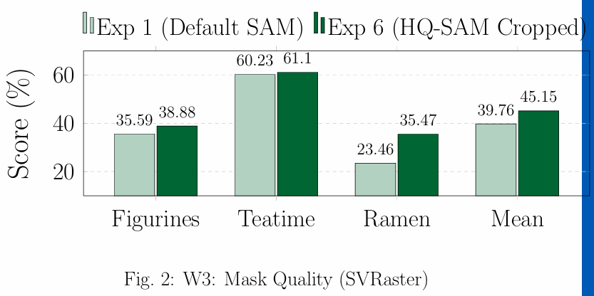
</p>
<p align="center"><em>Figure 6 — Work 3 mask-quality ablation: Default SAM (Exp 1) vs. HQ-SAM on cropped renders (Exp 6). Mean mIoU: 39.76% → 45.15% (+5.39%). The gain is largest on Ramen (+12.01%).</em></p>

**Loss-function ablation:** On the HQ-SAM baseline, VST (Exp 13) achieves the best mean mBIoU (42.65%) and IoU Acc@0.25 (54.81%) of any single-term configuration, while being effectively tied with Contrastive loss (Exp 11) on mean mIoU. As the primary methodological novelty of Work 3, VST is adopted as the final configuration.

<p align="center">
  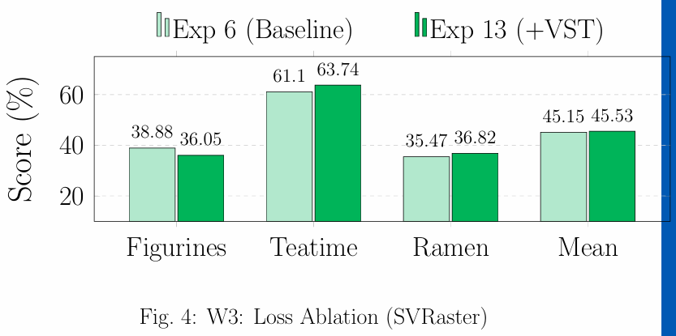
</p>
<p align="center"><em>Figure 7 — Work 3 loss-function ablation: Exp 6 (HQ-SAM Cropped baseline) vs. Exp 13 (+VST only). VST improves Teatime by +2.64% and Ramen by +1.35% while regressing slightly on Figurines. Mean mIoU: 45.15% → 45.53% (+0.38%).</em></p>

---

#### Work 4 — OpenGaussian Ablations

**Mask-quality ablation:** CAHMU-Unified SAM (Exp 7) is the clear winner across all three mask families, delivering +5.25% over the Large SAM baseline (Exp 1). The gain is most pronounced on Ramen (+16.62%), where CAHMU's orphan vacuum-filling recovers small foreground objects absent from large-level SAM. In-training scene cropping (Crop@30k) consistently hurts across all mask types, establishing a clean negative result for that design choice.

<p align="center">
  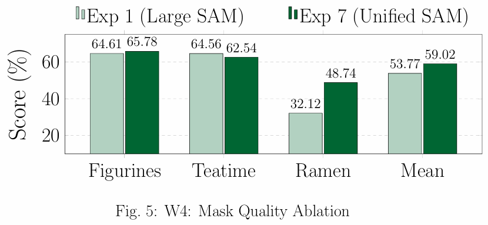
</p>
<p align="center"><em>Figure 8 — Work 4 mask-quality ablation: Large SAM baseline (Exp 1) vs. CAHMU-Unified SAM (Exp 7), both on original images with no in-training cropping. Mean mIoU: 53.77% → 59.02% (+5.25%). The gain is dominated by Ramen (+16.62%).</em></p>

**Training-method ablation — negative result:** Objectness-based cluster pruning (Exp 11) is severely detrimental on the Ramen scene (−19.20% mIoU, −34.70% on IoU Acc@0.5). Although the pruning correctly identifies low-objectness clusters in principle, it also removes genuine fine-grained foreground clusters that render below the objectness threshold under partial occlusion or unusual viewpoints. The Exp 9 baseline is retained.

<p align="center">
  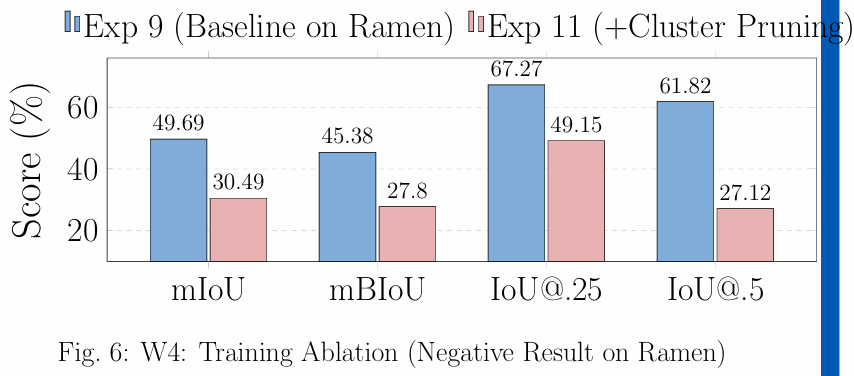
</p>
<p align="center"><em>Figure 9 — Work 4 training-method ablation (Ramen scene): Exp 9 baseline vs. Exp 11 (+Cluster Pruning). Cluster pruning is a clear negative result: mIoU drops from 49.69% to 30.49% (−19.20%) and IoU Acc@0.5 from 61.82% to 27.12% (−34.70%).</em></p>

**Inference re-ranking ablation — negative result:** Two-stage objectness re-ranking (Exp 10) collapses every metric, reducing mIoU from 49.69% to 20.25% (−29.44%) and IoU Acc@0.5 from 61.82% to 7.14% (−54.68%). The rendered-objectness signal consistently demotes the correct top-1 cosine candidate in favour of larger but semantically incorrect clusters. Single-pass cosine retrieval is retained as the final inference procedure.

<p align="center">
  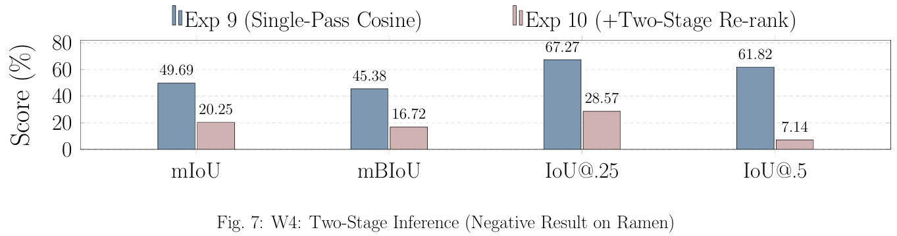
</p>
<p align="center"><em>Figure 10 — Work 4 inference re-ranking ablation (Ramen scene): Exp 9 (single-pass cosine, top-1) vs. Exp 10 (+two-stage objectness re-ranking, top-5 from top-10). Re-ranking is a clear negative result: mIoU collapses from 49.69% to 20.25% (−29.44%) and IoU Acc@0.5 from 61.82% to 7.14% (−54.68%).</em></p>

---

### Key Findings

> **Mask supervision quality is the dominant variable** — the largest single-step gains come from upgrading the mask type, not from any auxiliary loss, training modification, or inference change.

- **CAHMU-unified masks** are optimal for Gaussian based representations (Works 2 and 4), delivering +5.08% / +5.25% over default / Large-level SAM respectively.
- **HQ-SAM on cropped renders** is optimal for the Sparse Voxel based representations (Work 3), outperforming CAHMU-unified by +5.40% — the voxel depth-ordering amplifies HQ-SAM boundary precision.
- **In-training scene cropping (Crop@30k) is consistently detrimental** for OpenGaussian on LeRF tabletop scenes, degrading mean mIoU by ≈5–7%.
- Auxiliary losses (Cont, Hyp, GST/VST) produce effects within ≈1% mIoU on any baseline; **VST achieves the best mBIoU and IoU Acc@0.25** on Work 3's HQ-SAM voxel baseline.
- Objectness-based cluster pruning and two-stage re-ranking (Work 4) are counter-productive: they remove genuine foreground clusters or demote the correct cosine top-1 cluster.

---

## References

1. Ye, M. et al. **Gaussian Grouping: Segment and Edit Anything in 3D Scenes.** ECCV 2024. [[arXiv]](https://arxiv.org/abs/2312.00732) [[code]](https://github.com/lkeab/gaussian-grouping)

2. Wu, J. et al. **OpenGaussian: Towards Point-Level 3D Gaussian-based Open Vocabulary Understanding.** NeurIPS 2024. [[arXiv]](https://arxiv.org/abs/2406.02058) [[code]](https://github.com/muedavid/OpenGaussian)

3. Fang, Y. et al. **Sparse Voxels Rasterization: Real-time High-fidelity Radiance Field Rendering.** arXiv 2024. [[arXiv]](https://arxiv.org/abs/2409.12512) [[code]](https://github.com/theialab/svraster)

4. Shi, J. et al. **Language Embedded 3D Gaussians for Open-Vocabulary Scene Understanding.** CVPR 2024. [[arXiv]](https://arxiv.org/abs/2311.18482)

5. Qin, M. et al. **LangSplat: 3D Language Gaussian Splatting.** CVPR 2024. [[arXiv]](https://arxiv.org/abs/2312.16084) [[code]](https://github.com/minghanqin/LangSplat)

6. Cheng, H.-K. et al. **Tracking Anything with Decoupled Video Segmentation.** ICCV 2023. [[arXiv]](https://arxiv.org/abs/2309.03903) [[code]](https://github.com/hkchengrex/Tracking-Anything-with-DEVA)

7. Kirillov, A. et al. **Segment Anything.** ICCV 2023. [[arXiv]](https://arxiv.org/abs/2304.02643) [[code]](https://github.com/facebookresearch/segment-anything)

8. He, L. et al. **Segment Anything in High Quality.** NeurIPS 2023. [[arXiv]](https://arxiv.org/abs/2306.01567) [[code]](https://github.com/SysCV/sam-hq)

9. Kerbl, B. et al. **3D Gaussian Splatting for Real-Time Radiance Field Rendering.** SIGGRAPH 2023. [[arXiv]](https://arxiv.org/abs/2308.04079) [[code]](https://github.com/graphdeco-inria/gaussian-splatting)

10. Radford, A. et al. **Learning Transferable Visual Models From Natural Language Supervision (CLIP).** ICML 2021. [[arXiv]](https://arxiv.org/abs/2103.00020)

11. Kerr, J. et al. **LERF: Language Embedded Radiance Fields.** ICCV 2023. [[arXiv]](https://arxiv.org/abs/2303.09553) [[code]](https://github.com/kerrj/lerf)

12. Liu, S. et al. **Grounding DINO: Marrying DINO with Grounded Pre-Training for Open-Set Object Detection.** ECCV 2024. [[arXiv]](https://arxiv.org/abs/2303.05499) [[code]](https://github.com/IDEA-Research/GroundingDINO)

13. Yang, L. et al. **Depth Anything V2.** NeurIPS 2024. [[arXiv]](https://arxiv.org/abs/2406.09414) [[code]](https://github.com/DepthAnything/Depth-Anything-V2)

---

## Citation

If you find this work useful, please consider citing:

```bibtex
@mastersthesis{mullick2025openvocab3d,
  title     = {Comparative Analysis of Open-Vocabulary 3D Scene Understanding
               using Enhanced SAM Masks and Multiple Segmentation Methods},
  author    = {Suvrajit Mullick},
  school    = {Indian Institute of Science (IISc), Bengaluru},
  year      = {2026},
  type      = {M.Tech Thesis Report, Department of Artificial Intelligence}
}
```

---

<div align="center">
<sub>Indian Institute of Science (IISc) · Bengaluru · M.Tech. Artificial Intelligence</sub>
</div>
